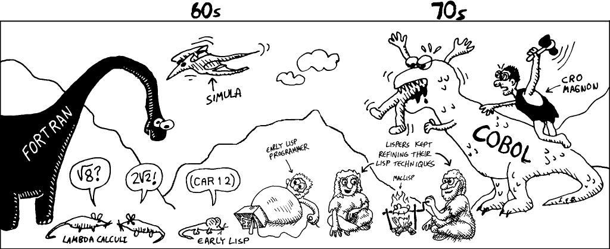

+++
date = '2024-09-06T00:00:00+08:00'
title = '程序设计方法'
tags = ["方法论"]
+++
# 认识你的语言
程序设计本身是一种语言应用，语言是个符号系统，是思想的载体。如何写代码，本质上体现了程序员如何对现实世界进行的抽象。传统的欧陆哲学中，语言没有被作为一门独立的学科来研究，但是许多其他领域不可分割的一部分。二十世纪初，分析哲学将语言哲学置于中心地位，主要关心的问题有：意义的本质、语言用法、语言认知及语言与现实的关系。

首先，我们不妨先了解一下编程语言的本质，之后再讨论如何更好的使用它。1960年John McCarthy 写了一篇关于关于符号表达式计算的论文《符号表达式的递归函数及其机器计算》。在这篇论文中，McCarthy向我们展示了用一种简单的数据结构S表达式(S-expression)来表示代码和数据，并在此基础上构建一种完整的语言。Lisp语言形式简单、内涵深刻，Paul Graham在《Lisp之根源》中将其对编程的贡献与欧几里德对几何的贡献相提并论。Lisp原意为表处理(LISt Processing)，是第二悠久的高级编程语言，只有Fortran比它早一年。




在计算机技术发展过程中，Lisp遭遇了人工智能寒冬，逐渐被人遗忘；而现代主流编程语言，或多或少仍能看出Lisp的影子，如：if-then-else、递归函数、垃圾回收、函数是一种数据、宏等。

# 数据结构
构造元(Cons Cell)是Lisp最基本的数据结构，由两个存放地址的内存空间组成
- CAR - Contents of the Address part of the Register
- CDR - Contents of the Decrement part of the Register


这个命名习惯，源自Lisp最初实现的硬件环境。IBM 704上一个字由36位组成，其中A类指令的前3位为操作类型，3到17位表示减量，18-20位标识Tag，21-35位表示地址。如果Tag标记的Index Register中的值大于Decrement，则Index Register减少Decrement，否则跳转到Address，这可用于实现循环。


通过这个最基本的构造单元，可以组成List、Tree等各种复杂的数据结构。

_Dotted Pair_


```
* (cons 1 2)
(1 . 2)
```

_List_


```
* (cons 1 (cons 2 (cons 3 nil)))
(1 2 3)
```

_Tree_


```
* (cons (cons 1 2) (cons 3 4))
((1 . 2) 3 . 4)
```

在Lisp中除Cons Cell之外，均为原子(atom)类型，如：数字、字符、符号、空列表等。

# 运算规则
Lisp只有一种语法结构：S-表达式。其计算过程为：取第一个元素作为操作符，遍历剩下的元素作为操作数。
基础函数有5种，用于断言计算
```lisp
(atom x)    ; 是否为原子类型
(eq x y)    ; 两个原子类型是否相等
(cons x y)  ; 构造一个构造单元
(car x)     ; 取出单元car头部
(cdr x)     ; 取出单元cdr尾部
```
组装函数有4种，用于逻辑组装
```lisp
(quote x)    ; 返回表达式，而不求值
(cond (p1 e1) ... (pn en))            ; 分支判定, p为true时，对e求值
((lambda (p1 ... pn) e) a1 ... an)    ; 定义函数, 将a1 ... an 代入 p1 ... pn 后，计算e
(label f (lambda (p1 ... pn) e))      ; 定义标签, 在e中可使用f替代lambda, 以实现递归
```
这就是Lisp语言的全部，通过对这几个基本的函数的组装、扩展，就可以实现各种计算表达。比如
```lisp
; (quote x) 简化 为 'x
; f=(label f (lambda (p1 ... pn) e)) 等同于 (defun f (p1 ... pn e))

(defun null. (x)
  (eq x '()))

(defun and. (x y)
  (cond (x (cond (y 't) ('t '())))
        ('t '())))

(defun not. (x)
  (cond (x '())
        ('t 't)))

(defun append. (x y)
  (cond ((null. x) y)    ; 若x为空, 返回y
        ('t (cons (car x) (append. (cdr x) y))))) ; 取出x头, 与x尾和y合并结果拼接

(defun list. (x y)
  (cons x (cons y '())))

(defun pair. (x y)
  (cond ((and. (null. x) (null. y)) '())           ; x, y 为空
        ((and. (not. (atom x)) (not. (atom y)))    ; x, y 非原子类型
         (cons (list. (car x) (car y))
               (pair. (cdr x) (cdr y))))))

(defun assoc. (x y)
  (cond ((eq (caar y) x) (cadar y))
        ('t (assoc. x (cdr y)))))
```
有了`lambda`和`label`就可以将函数像数据一样，作为参数变量传递，就可以实现闭包（将函数、数据绑定成一个结构，数据开辟在堆上，函数调用后数据依然存在）。

# 宏定义
反引号`` ` ``和单引号`'`作用相似，返回表达式本身，但同时又支持一些特殊的能力
- `,` comma 对某个部分重新求值
- `,@` comma-at 将后续列表展开
```lisp
(defmacro if. (condition then else)
    `(cond (,condition ,then)
           (t ,else)))

* (macroexpand-1 '(if. (= nil ()) "eq" "neq"))
(COND ((= NIL NIL) "eq") (T "neq"))
T
```
# 对象系统
`CLOS (Common Lisp Object System)`最早在1988年发表，并在1994年成为ANSI标准的Common Lisp的一部分。没错，Lisp也可以用来做面向对象编程。
- `defclass` 定义一个类型
- `defemthod` 定义一个类型的方法
- `make-instance`创建一个对象
- `slot-value` 通过槽访问类的属性
- `setq` 相当于 `set (quote ...)`
- `setf` 用于通过slot给字段赋值
```lisp
(defclass rectangle ()
  (height width))

(defmethod area ((x rectangle))
  (* (slot-value x 'height) (slot-value x 'width)))

(setq r (make-instance 'rectangle))
(setf (slot-value r 'height) 2 (slot-value r 'width) 3)
(area r)
6
```
关于Common Lisp更多的语言特性，可以参考《ANSI Common Lisp》《Practical Common Lisp》等资料。由于Lisp语言本身是一种范式定义，所以很容易实现、扩展，可以参考《Build Your Own Lisp》这本书的内容。

许多基于虚拟机实现的现代Lisp方言依然还在活跃中，比如一个用clojure编写的接口处理方法可能看起来是这样的。
```lisp
(defroutes api-routes
  (GET "/user/:name" [name]
       (json-response
        (jdbc/query
         (connection)
         ["select * from user where name=?" name]
         ;; [optional] list => entity
         :result-set-fn first
         ;; [optional] format entity
         :row-fn (fn [x] (assoc x :text (str (:name x) " already " (:age x) " years old.")))
         ))))
```
我们学习Lisp，并不一定用它来开发某个实际的项目，而是为了学习它的“大道至简”的思想，不受语法糖崇拜的干扰，直击逻辑抽象的本质。当你逐渐适应并掌握了这些语法应用能力后，面向一个新的语言时，通过了解它的特性，你可以迅速判断出它的能力边界，并选取最佳使用方法。

# 一个函数的诞生
`天下难事，必作于易；天下大事，必作于细` ——《老子·德经·第六十三章》。函数是系统组成的最小单元，一个个函数的实现关乎整个工程最终的质量。评判一个函数实现的好坏，关键在于：易读、易用、易扩展。

## 易读
最直接的问题是如何命名？
- 选用最朴素的词语，遵循业务场景的概念定义，降低理解成本。
- 使用统一的词语，遵循技术选型所处的生态环境。比如Java项目用CamelCase；PHP/C项目用snake_case 风格
针对大多数场景，这里有一些命名经验可供借鉴。

### 前缀
- `get` - 获取单条结果；条件参数直接展开，不做类型封装，。
- `list`- 获取多条结果；如果查询条件有可选组合，封装`xxxQuery`命名的查询对象
- `paginate` - 翻页获取多条结果；参数中通常在`xxxQuery`基础上增加`Page`和`PageSize`条件。
- `create` - 创建记录，参数可以是单条或者多条
- `update` - 单条更新
除了常见的CRUD场景，也可以从语言本身、设计模式等领域找到合适的命名风格。如`Append`、`Apply`、`Handle`、`Process`、`Patch`、`Sync`、`Marshal/Unmarshal`等等

### 后缀
为了区分不同条件的get 和 update场景，可以用`get_x_by_y`或`update_x_by_y`风格命名；相对来说，单条查询和更新的逻辑是少量的，不会产生函数爆炸。

## 易用
首先，这里要求我们有对编码有着极高的热情，能够不断的精益求精，如果本着“能用就行”的心态，是不可能写出易用的代码。
函数的本质，是某种固定逻辑的封装。一个易用的函数，通常具有高内聚、低耦合的特征，即：对逻辑封装彻底完整，对外界产生最少的依赖。这里有一个最简单有效的“检测函数是否易用”的方法：从用户视角出发，使用你的函数。比如，写个单元测试：

- 如果测试覆盖率太低，说明函数内聚不高。通常是由于函数过大，承担了太多的逻辑封装，需要拆解。
- 如果测试数据上下文不容易构建，说明函数耦合度太高。需要考虑将上下文进行结构转换：
  - 重定义输入、输出结构，隔离数据对象依赖。
  - 重定义接口类型，并用适配代码访问隔离资源依赖。

编写测试代码，是最直接、有效的提升个人代码设计能力的手段，当你发现自己的代码难以测试时，一定会想办法进行拆解优化，Eating your own dog food！如果对测试数据命名感到困难，可以考虑用alice、bob、charles..等数据，以26个字母开头造字，比user_001容易区分。

## 易扩展
开闭原则是面向对象原则的核心，是编程中最重要、最基本的原则，其本意为：软件中的对象，应该对扩展是开放的，但对于修改的封闭的。后续我们将从设计模式的角度重新认识如何扩展，在此之前，我们先来看看函数层的扩展问题。首先，我们需要区分出两个概念：可变和非可变。一个函数本质上是一个逻辑的固化，逻辑流程是非可变的，但参数是可变的，所以在函数层面，可以通过更改参数内容进行扩展，比如：
- 定义参数结构，代替直接传递参数，之后增加新的字段时，不需要更改方法签名。
- 传入回调函数、闭包或处理器类型，以实现局部逻辑变更。通常是`Handler`、`Processor`、`Job`类型的参数
这里以Go语言中的Options Pattern为例说明，通过使用闭包增加新功能时，无需修改原有代码，实现可扩展。

```go
type Server {
  host string
  port int
  maxConn int
}

func New(options ...func(*Server)) *Server {
  srv := &Server{}
  for _, o := range options {
    o(srv)
  }
  return srv
}

func WithHost(host String) func (*Server) {
  return func (s *Server) {
    s.host = host
  }
}

func WithPort(port int) func (*Server) {
  return func (s *Server) {
    s.port = port
  }
}

srv := New(
    WithHost("localhost"),
    WithPort(8080))
```
当你进行一些底层库代码开发时，会遇到另一种扩展问题：类型扩展。如：
- 数据库访问驱动，需要支持哪些类型？
- 消息队列的数据对象，需要支持哪些类型？
这里建议：以基础类型（如：数字、字符、字节）为原型，封装对应的处理逻辑，对外提供类型、逻辑注册入口。这样，即满足高频逻辑固化，也允许面对特殊场景时，扩展新的类型处理。

## 模板化
上面的特性和原则，都是从函数外部视角观察到的，其内部应该如何实现取决于具体的业务逻辑。但是仍然可以找到一些共性。大多数函数，即使被调用方，同时也是调用方，在整个软件结构中具有承上启下的角色。所以基本上需要包含如下几个步骤：
```go
func do_something() {
// 输入检查

// 输入转换

// 处理逻辑

// 错误检测

// 结果转换
}
```
- 输入检查
  - 在执行任何高损耗的计算之前，进行请求有效性检查。
  - 若请求参数有误，返回错误原因，提示用户进行请求修正后重试。
  - 若系统状态异常，返回错误原因，表示无法处理请求，避免用户重试。
- 数据转换，在执行下游逻辑调用前，进行必要的结构转换。
- 处理逻辑，调用下游逻辑。
- 错误检测，调用是否正常，是否需要进行合适的错误消息转换。
- 结构转换，将下游返回结果，转换为上游所需的结构。

按照上述方法、模版结构组织代码，整体上起码看起来不至于太乱。有兴趣的同学，可以进一步阅读《Unix编程艺术》，参考里面的设计思想。

# 复杂的系统模块
在掌握单个函数的设计方法后，我们可以看一下更大的问题范畴；

## 设计模式
针对软件设计中普遍反复存在的各种问题，总结出的一系列的解决方案。实际应用中，不一定需要使用所有的模式，但有几个常见的模式需要掌握：
- 策略模式 ，面向统一接口，实现一系列逻辑策略，让他们可以相互替换。如：上述的类型扩展场景。
- 适配器模式，通过一个转换对象，使原本不兼容的对象可以进行交互。
- 命令模式，将请求转化成一个相对独立的对象。如：任何涉及网络请求处理的场景、RPC、缓存客户端。
- 责任链模式，针对请求处理链上的每个单元都可以处理请求，或转发给下一个处理单元。如：权限验证。
- 装饰器模式，包装已有对象，在原代码逻辑上增加新的功能后，替换原对象的角色。
- 模板方法，固化主要的逻辑流程，并空出抽象方法，交由子类实现。
上述几个模式，会在日常项目迭代中高频使用。恰当地应用这些模式，不仅可以使系统结构更加清晰、易扩展，同时也可以让其他人迅速理解系统的结构。若你想了解更多，可以进一步阅读参考中的《设计模式》内容。

## 架构模式
设计模式通常是面向某个特定模块的提供解决方案，具有一定规模的复杂系统，通常是多种模式的组合应用。例如：常见的Web开发框架多采用MVC结构，其中的View视图模块多采用策略模式，Control控制模块多采用责任链和命令模式。此时已经超出了设计模式的范畴，我们需要另一种更高级的设计方法，来解决软件如何架构的问题。这里可以参阅《Software Architecture Patterns》这本书。

### 分层架构 Layered Architecture
分层是最最基本、最常用的架构方式。分层架构的关键目的是为了隔离，将业务逻辑封装在特定的层次，当发生变更时只影响局部。比如：更换数据库选型只影响Data和Persistence层；由页面访问，调整为API访问，只需要调整`User Interface`和`Presentation`层。


_优点_
- 在层次隔离复用的前提下，支持应用的快速构建。
- 结构简单，对于架构经验不丰富的团队，也能用好。
- 应用结构清晰，利于测试和维护。

_缺点_
- 代码和模块的不经过严格的组织，可能导致结构混乱。
- 跨层调用，导致结构耦合，可能引发逻辑不清。
- 应用发生任何修改，都需要重新部署。

### 事件驱动 Event-Driven Architecture
事件驱动架构，是分层之外另一个最常用的架构模式，特别是在分布式系统场景中广泛使用，比如电商系统中，订单、交易、物流、结算等系统之间的事件数据。支持高度解耦，规模灵活可变，是典型的命令模式和责任链模式的组合应用。事件驱动架构主要包含两个组件：
- `Broker` 负责事件接收，可以是中心化的（所有事件发到一个节点），也可以是分布式的（按事件类型进行分组）
- `Event Processor/Consumer` 负责事件处理；也可以在事件处理后，转发给`Broker`，路由到其他`Processor`。


_优点_
- 当事件仅和很少的模块进行交互，即：`Processor`的逻辑较为简单时，适用。
- 用户界面友好，迭代新功能时只需增加消息订阅即可。

_缺点_
- 单个模块独立时容易测试，但整个处理流程测试困难。
- 当多个模块消费同一个事件时，错误处理变得困难。
- 消息结构必须简单，包含过多数据结构，会导致系统开发困难。
- 消息需要多个模块协同处理时，不容易做事务管理。

### 微内核架构 Microkernel Architecture
也可以称为插件化架构（Plugin-in Architecture），基于核心模块，面向功能进行拆分，实现可扩展的一种架构。典型应用如IDE插件、浏览器插件、OSGI技术、操作系统内核等。插件模块间相对独立，部分模块失效影响其他模块的正常运行。微内核架构包含两类组件：
- Core System 核心系统负责与业务功能无关的通用功能，如：模块加载、模块间通信等。
- Plug-in Modules 插件系统负责实现具体的业务逻辑。
比如一个任务调度系统，核心模块负责逻辑调度和任务触发，插件系统负责具体任务的执行。

_优点_
- 应用结构清晰，可以看出清晰的核心和扩展模块。
- 适用于核心相对稳定，而模块需要频繁更新的场景。

_缺点_
- 在有插件依赖的情况下，很难调整核心结构。
- 在将来业务变得更复杂时，很难为内核函数提前选择正确的粒度。

### 微服务架构 Microservices Architecture
微服务架构是单体架构（Monolithic）、面向服务架构的之后的继承者。基于容器技术，使多个服务共同运行在一个服务器上。由于每个服务更轻量，所以解耦和服务化做得更彻底。服务之间通过RPC调用，且每个服务单独开发、部署、测试，服务之间互不影响。Netflix是微服务架构的首批主要推动者之一，通过小规模团队开发了上百个微服务。


_优点_
- 由于服务之间相互独立，适合业务的快速开发迭代。
- 系统由多个小模块组成，团队分散时适合使用。

_缺点_
- 如何正确的设计好一个服务的粒度是个挑战。
- 任务在多个服务之间传递，导致性能不佳。

## 架构对比
每种架构模式都有其适用的业务场景和优缺点，一个具有规模的复杂系统，往往需要子系统协同完成工作，实际应用中可以根据需要组合使用。比如：下单系统内部采用分层架构、订单状态扭转使用消息驱动架构、而订单号的生成、日历计算等功能又采用微服务架构。
除了上述常见的软件架构模式，感兴趣的同学，可以继续阅读《The Architecture of Open Source Applications》卷1、卷2的内容，进一步了解更多的实践案例。这里首先推荐`Berkeley DB`、`Graphite`、`Riak`、`SQLAlchemy`、`Twisted`、`ZeroMQ`这几个项目。

# 技术模式之外
上述的各种设计模式、架构模式，关注的都是系统内自身的问题。当面对业务发展越来越复杂的时候，还会有一些非技术的问题。比如：
- 业务中大量的术语、词汇可能产生冲突，下单、支付、物流等系统里的“订单”是否是一个概念？
- 跨服务调用的时候，这些概念是否使用相同的对象结构？大量的结构定义和转换逻辑代码应该如何管理？
- 如果采用最基本的分层架构，系统内部应该如何实现？
针对这些问题，可以阅读Evans Eric的《Domain-Drive Design》


本质上，领域建模解决的是：单个系统内分层，逻辑隔离问题。除此之外，还有强化基建，解决多系统间分层，资源能力复用沉淀问题；平台化，面向用户行为，工作流程规范化问题等等。

# 参考
- [Recursive Functions of Symbolic Expressions and Their Computation by Machine](https://www-formal.stanford.edu/jmc/recursive.html)
- [The Root of Lisp](http://daiyuwen.freeshell.org/gb/rol/roots_of_lisp.html)
- [Land of Lisp](http://landoflisp.com/)
- [History of Lisp](http://jmc.stanford.edu/articles/lisp.html)
- [ANSI Common Lisp](https://acl.readthedocs.io/en/latest/)
- [Practical Common Lisp](https://gigamonkeys.com/book/)
- [Build Your Own Lisp](https://buildyourownlisp.com/)
- [Software Architecture Pattern](https://theswissbay.ch/pdf/Books/Computer%20science/O%27Reilly/software-architecture-patterns.pdf)
- [The Architecture of Open Source Applications](https://aosabook.org/en/)
- [Domain-Driven Design](https://github.com/ShineFan/awesome-programming-books-1/blob/master/CleanCode/%E9%A2%86%E5%9F%9F%E9%A9%B1%E5%8A%A8%E8%AE%BE%E8%AE%A1%EF%BC%9A%E8%BD%AF%E4%BB%B6%E6%A0%B8%E5%BF%83%E5%A4%8D%E6%9D%82%E6%80%A7%E5%BA%94%E5%AF%B9%E4%B9%8B%E9%81%93.pdf)
