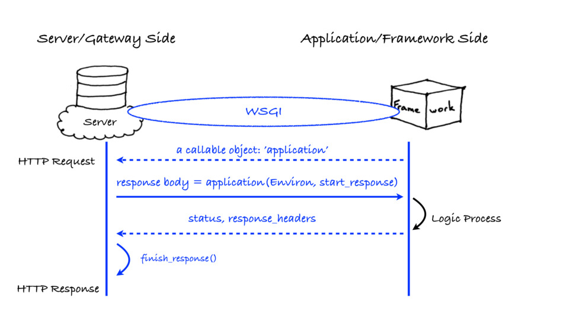
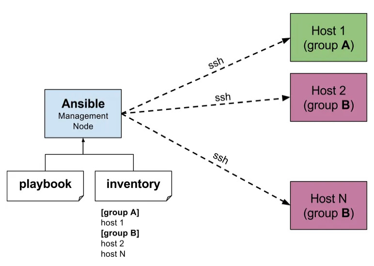

+++
date = '2023-04-27T00:00:00+08:00'
title = 'Python必知必会'
tags = ["python"]
+++
本篇不介绍Python语言特性，仅着重介绍项目结构和常用工具，为初学者建立正确的工程架构提供参考。若有意深入研读相关框架工具原理源码，请务必掌握如下Python语言高级特性
- Lambda
- [装饰器](https://python3-cookbook.readthedocs.io/zh-cn/latest/chapters/p15_c_extensions.html)
- [Eventlet](https://eventlet.readthedocs.io/en/latest/)
- [C语言扩展](https://python3-cookbook.readthedocs.io/zh-cn/latest/chapters/p15_c_extensions.html)

# 环境准备

## vitrualenv
创建一个独立隔绝的虚拟环境，用来安装工程所需的依赖包
> `virtualenv` is a tool to create isolated Python environments. Since Python 3.3, a subset of it has been integrated into the standard library under the venv module https://virtualenv.pypa.io/en/latest/

```sh
python3 -m venv venv
source venv/bin/activate
which python
deactivate
```

# 依赖管理

## pip
包管理工具，用于安装、卸载、检查依赖。可通过`freeze`将依赖关系导出到文件，后通过`install -r`恢复
> `pip` is the package installer for Python. You can use pip to install packages from the Python Package Index and other indexes. https://pypi.org/project/pip/

```sh
pip install <package>
pip uninstall <package>
pip list

pip freeze > requirements.txt
pip install -r requirements.txt
```

`pip uninstall`卸载指定的包，也可以使用`pip-autoremove`自动卸载其依赖的其它无用的包

# 项目管理
## Distutils
`distutils` 是标准库中负责建立Python第三方库的安装器，使用它能够进行Python模块的安装和发布。通过定义一个setup.py文件，包含名称、版本、依赖等信息。详情参考https://docs.python.org/zh-cn/3.7/distutils/apiref.html#distutils.core.setup
> The distutils package provides support for building and installing additional modules into a Python installation. The new modules may be either 100%-pure Python, or may be extension modules written in C, or may be collections of Python packages which include modules coded in both Python and C.

```python
#!/usr/bin/env python

from distutils.core import setup

setup(
    name='Hello',
    version='1.0',
    packages=['hello'],
)
```
通过`python setup.py`命令执行对应的操作
```sh
(venv) $ python setup.py build
running build
running build_py
creating build
creating build/lib
creating build/lib/hello
copying hello/__init__.py -> build/lib/hello
```

| 常用命令 ｜ 说明 ｜
| --- | --- |
| `python setup.py build` | 构建项目，结果导出到`build`目录 |
| `python setup.py install` | 安装项目，到`python`命令所属环境 |
| `python setup.py sdist` | 创建源代码分发包，生成`<Package>-<Version>.tar.gz`文件到`dist`目录 |
| `python setup.py bdist` | 创建二进制分发包，生成`<Package>-<Version>.<arch>.tar.gz`到`dist`目录 |

```sh
$ python setup.py --help-commands
Standard commands:
  build            build everything needed to install
  build_py         "build" pure Python modules (copy to build directory)
  build_ext        build C/C++ extensions (compile/link to build directory)
  build_clib       build C/C++ libraries used by Python extensions
  build_scripts    "build" scripts (copy and fixup #! line)
  clean            clean up temporary files from 'build' command
  install          install everything from build directory
  install_lib      install all Python modules (extensions and pure Python)
  install_headers  install C/C++ header files
  install_scripts  install scripts (Python or otherwise)
  install_data     install data files
  sdist            create a source distribution (tarball, zip file, etc.)
  register         register the distribution with the Python package index
  bdist            create a built (binary) distribution
  bdist_dumb       create a "dumb" built distribution
  bdist_rpm        create an RPM distribution
  bdist_wininst    create an executable installer for MS Windows
  check            perform some checks on the package
  upload           upload binary package to PyPI
```
`distutils`对于简单的分发很有用，但功能较少。
> Distutils is deprecated with removal planned for Python 3.12.
## Setuptools
`setuptools`是`distutils`增强版，不包括在标准库中。其扩展了很多功能，能够帮助开发者更好的创建和分发 Python 包。大部分用户会使用更先进的setuptools模块，只需要更换引用即可。
> Setuptools is a fully-featured, actively-maintained, and stable library designed to facilitate packaging Python projects. It helps developers to easily share reusable code (in the form of a library) and programs (e.g., CLI/GUI tools implemented in Python) https://pypi.org/project/setuptools/

```python
from setuptools import setup
```
相比前者`setup`增加了额外特性，其中比较重要的几个
详情参考 https://setuptools.pypa.io/en/latest/deprecated/changed_keywords.html，
- `install_requires` 代替 `requires` 自动安装依赖。`requirements.txt`管理开发依赖，二者略不同
- `packages=find_packages()` 自动搜索包
- `entry_points` 注册入口，比如定义`console_scripts`在安装后可执行的命令
此外还支持`python setup.py develop`命令进行开发方式安装，源码变更后应用立即生效。

# 部署
针对库和命令工具，可直接发布到pip源供安装使用；Web服务需要遵循WSGI规范进行部署

## devpi
The MIT-licensed devpi system features a powerful PyPI-compatible server and a complementary command line tool to drive packaging, testing and release activities with Python https://github.com/devpi/devpi

## WSGI
全称 Web Server Gateway Interface，或者 Python Web Server Gateway Interface ，是为 Python 语言定义的 Web 服务器和 Web 应用程序或框架之间的一种简单而通用的接口。最早由[PEP-333](https://peps.python.org/pep-0333/)定义，当前版本v1.0.1由[PEP-3333](https://peps.python.org/pep-3333/)定义。自从 WSGI 被开发出来以后，许多其它语言中也出现了类似接口。WSGI协议把整个web服务端分为三个部分：Server、Application、Middleware。

- Server负责从客户端接受请求，将Request转发给Application，再将返回的Response返回给客户端
- Application负责接收Request，处理请求，并返回结果给Server
- Middleware介于二者之间，又同时具备两种角色的能力
```python
# hello/app.py
def app(env, start_response):
    start_response('200 OK', [('Content-Type', 'text/html')])
    return [b'Hello app']
```
可以直接用[uwsgi](https://uwsgi-docs.readthedocs.io/en/latest/)启动一个服务 
```sh
$ pip install uwsgi
$ uwsgi --http :8080 --wsgi-file hello/app.py
```
也可以使用某个按照WSGI实现的Server容器启动服务，如[Gunicorn](https://gunicorn.org/)
```sh
$ pip install gunicorn
$ gunicorn -b :8080 hello.app:app
```
在Python中method、class和instance都可以是callable类型
```python
class App:
    def __init__(self, env, start_response):
        pass

    def __iter__(self):
        yield b'Hello App'

class AppObj:
    def __call__(self, env, start_response):
        return [b'Hello AppObj']

appObj = ApplicationObj()
```
## PasteDeploy
PasteDeploy是一套发现和配置WSGI应用的系统。它根据指定的配置文件动态生成入口点和组织WSGI application间的逻辑关系。简单来说，就是可以将各种资源（静态、应用服务）整合起来，作为一个整体对外提供服务。配置文件使用ini格式，定义多个section片段组合。

> This tool provides code to load WSGI applications and servers from URIs. These URIs can refer to Python eggs for INI-style configuration files https://docs.pylonsproject.org/projects/pastedeploy/en/latest/index.html

常用片段类型有
- `app` WSGI application 
- `composite` 多个应用组合，可以根据规则进行请求转发
- `filter` WSGI middleware，如鉴权、限流
- `pipeline` 按照顺序执行一系列的middleware和应用

执行时以命名为`main`的的片段为入口
```
# paste.ini
[composite:main]
use = egg:Paste#urlmap
/ = home
/hello = hello

[app:main]
use = egg:Paste#static
document_root = %(here)s/static

[app:hello]
paste.app_factory = hello.app:app_factory
```
创建应用
```python
# hello/app.py
def app(env, start_response):
    start_response('200 OK', [('Content-Type', 'text/html')])
    return [b'Hello app']

def app_factory(global_config, **local_conf):
    return app
```
使用gunicorn加载启动
```sh
$ pip install Paste PasteDeploy
$ gunicorn --paste paste.ini -b :8080
```

# 常用工具
## pbr
[pbr](https://docs.openstack.org/pbr/)是 setuptools 的辅助工具，最初是为 OpenStack 开发，将内容提取到setup.cfg中。好处是
- 从git中获取Version、AUTHORS and ChangeLog信息
- 读取requirements.txt，生成setup函数需要的依赖，统一管理
- 读取README文件，生成long_description描述

```python
#!/usr/bin/env python

from setuptools import setup

setup(
    setup_requires=['pbr'],
    pbr=True,
)
```
```
# setup.cfg
[metadata]
name = hello
description_file = README

[files]
packages =
    hello
```
## oslo.config
[oslo.config](https://docs.openstack.org/oslo.config/) 作为OpenStack的通用组件，用于管理配置，在每一个项目中都有用到。
- 使用ini文件管理配置信息
- 执行时通过 config-file 读取配置信息
```python
# conf.py
from oslo_config import cfg
import sys

opts = [
    cfg.StrOpt('ip', default='127.0.0.1', help='Ip address'),
    cfg.IntOpt('port', default=9090)
]

cfg.CONF.register_cli_opts(opts)    # 注册CLI参数
cfg.CONF(args=sys.argv[1:])         # 接收CLI和配置文件参数

print(cfg.CONF.ip, cfg.CONF.port)
```

```
# conf.ini
[DEFAULT]
ip=0.0.0.0
```

```sh
$ python conf.py # 代码配置
127.0.0.1 9090

$ python conf.py --config-file conf.ini # 配置文件 > 代码配置
0.0.0.0 9090

$ python conf.py --config-file conf.ini --port=8080 # CLI参数 > 配置文件
0.0.0.0 8080
```

## Ansible
[ansible](https://github.com/ansible/ansible) 分布式自动化运维工具，RedHat出品，通过ssh分发命令到集群进行批量配置、部署、执行。

- 将控制节点的 `~/.ssh/id_rsa.pub` 添加到 服务节点的 `~/.ssh/authorized_keys` 文件中
- 将被管理节点的`ip`分组添加到`hosts`文件中
```
# hosts
[local]
127.0.0.1
```
```sh
$ ansible -i hosts all -m ping # 向所有节点发送 ping 命令
127.0.0.1 | SUCCESS => {
    "ansible_facts": {
        "discovered_interpreter_python": "/usr/bin/python3"
    },
    "changed": false,
    "ping": "pong"
}

$ ansible -i hosts local -a "uname -a" # 向local分组的节点发送 uname 命令
127.0.0.1 | CHANGED | rc=0 >>
Darwin C02D418TML87 22.3.0 Darwin Kernel Version 22.3.0: Mon Jan 30 20:42:11 PST 2023; root:xnu-8792.81.3~2/RELEASE_X86_64 x86_64
```
## SQLAlchemy
https://www.sqlalchemy.org/ Python世界中最有名的ORM框架，另一个是著名框架Django内嵌的ORM.

## Flask
[flask](https://flask-zh.readthedocs.io/) 相对于“大而全”的Django而言，是“小而美”的轻量级Web框架
- 使用[Werkzeug](https://werkzeug.palletsprojects.com/)作为WSGI工具库 
- 使用Jinja作为模板引擎
- 轻巧、简洁，极易通过扩展集成各种外部资源，比如SQLAlchemy
```python
from flask import Flask

app = Flask(__name__)

@app.route("/")
def hello():
    return "<p>Hello, Flask!</p>"
```
```
$ gunicorn demo:app

# 或使用flask自带的命令工具, 使用debug开发模式，支持热部署
$ flask --app demo --debug run
```

# 参考
- [Writing a Package in Python](https://web.archive.org/web/20200227202149/https://zetcode.com/articles/packageinpython/)
- [The Story of Wheel](https://wheel.readthedocs.io/en/stable/story.html) The Egg format was introduced by setuptools in 2004, whereas the Wheel format was introduced by PEP 427 in 2012.
