+++
date = '2023-02-08T00:00:00+08:00'
title = 'RTOS系统移植'
tags = ["rtos"]
+++

# 硬件
开发板 STM32F103C8T6 核心板，也称STM32 Blue Pill
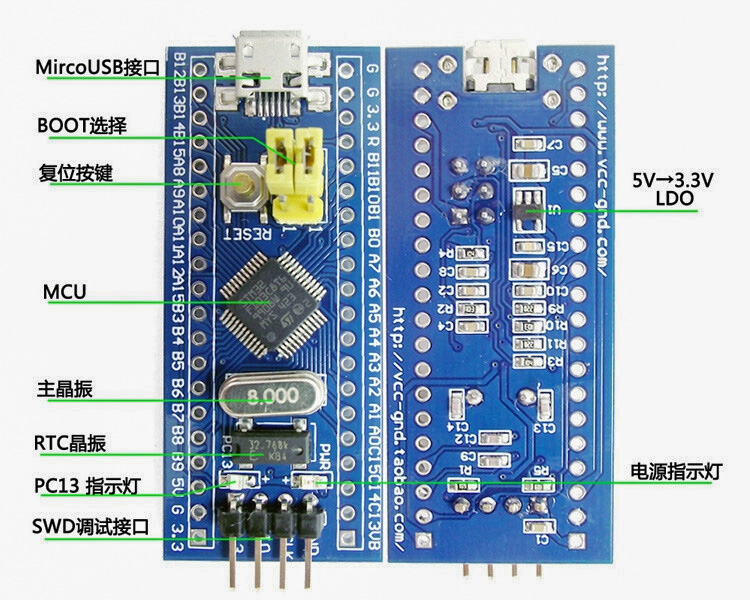

下载器 STLink

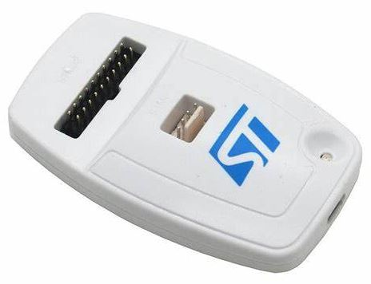

# 软件
[STMCubeIDE](https://www.st.com/en/development-tools/stm32cubeide.html) 是意法半导体基于Eclipse构建的开发工具，可以快速生成项目框架。 

选择芯片为STM32F103
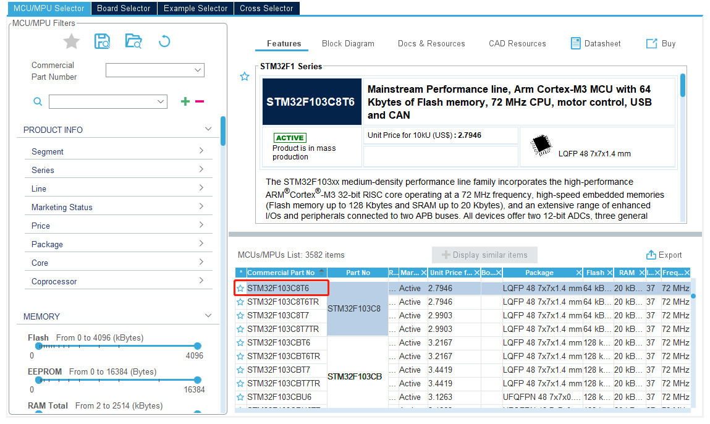

配置端口、时钟和调试模式
- `GPIO/PC13` 为`GPIO_Output`模式
- `RCC/High Speed Clock` 高速时钟源为`Crystal/Ceramic Resonator` 晶振/ 外部陶瓷振荡器
- `SYS/Debug` 调试模式为`Serial Wire`
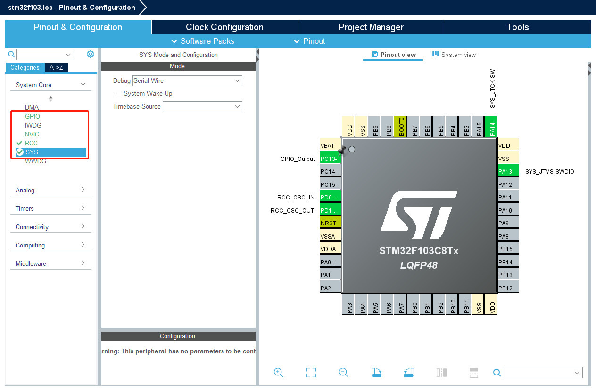

设置HCLK高速总线时钟为72MHz
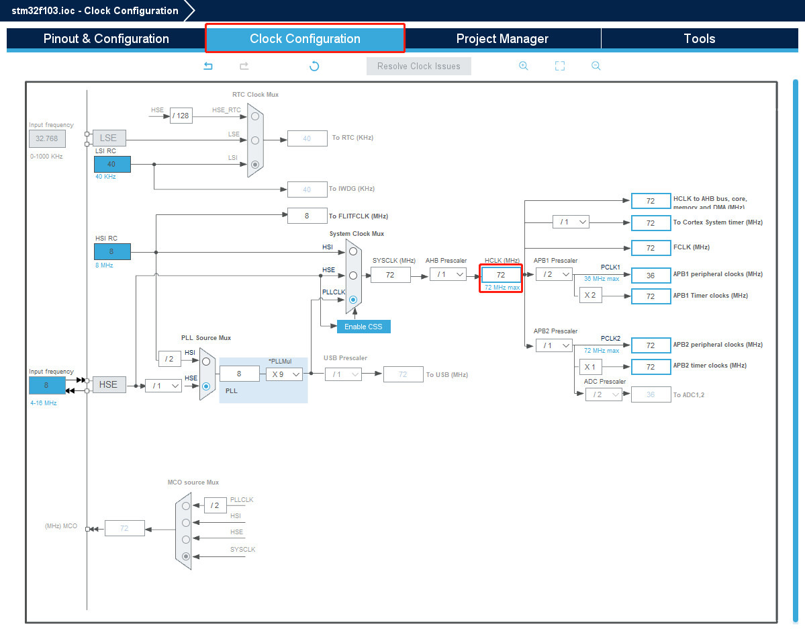

生成独立的头文件
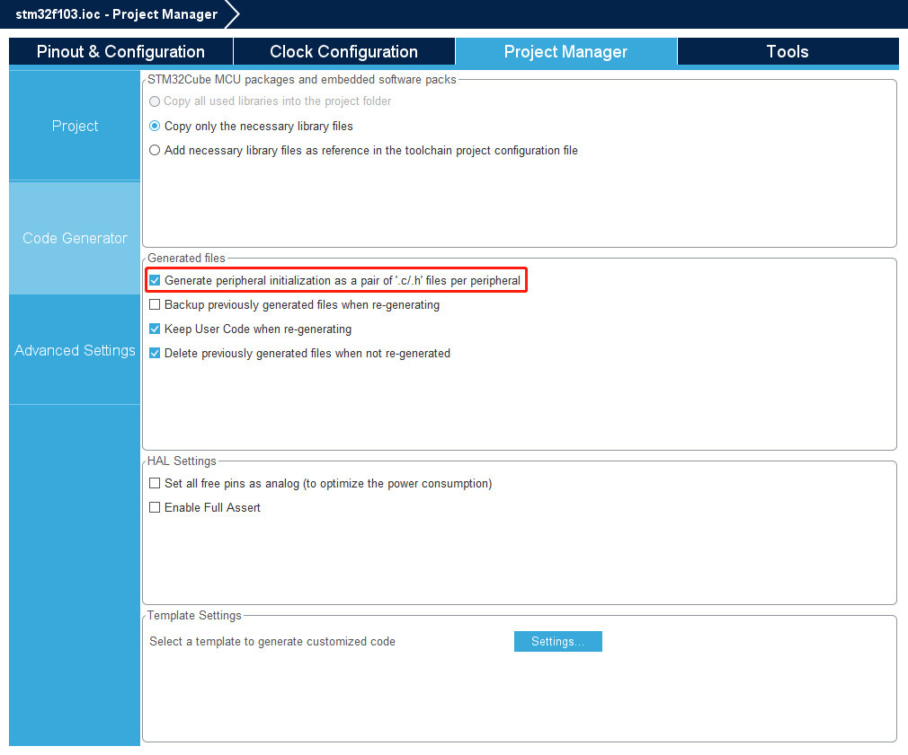

保存设置后，提示自动生成代码。只要在指定区域编写用户代码，后续修改ioc的配置可重新生成代码。这里通过HAL库函数修改GPIOC的状态，跟踪这些库函数可以看到，GPIOC、GPIOC_BASE等均是对应寄存器的地址定义。
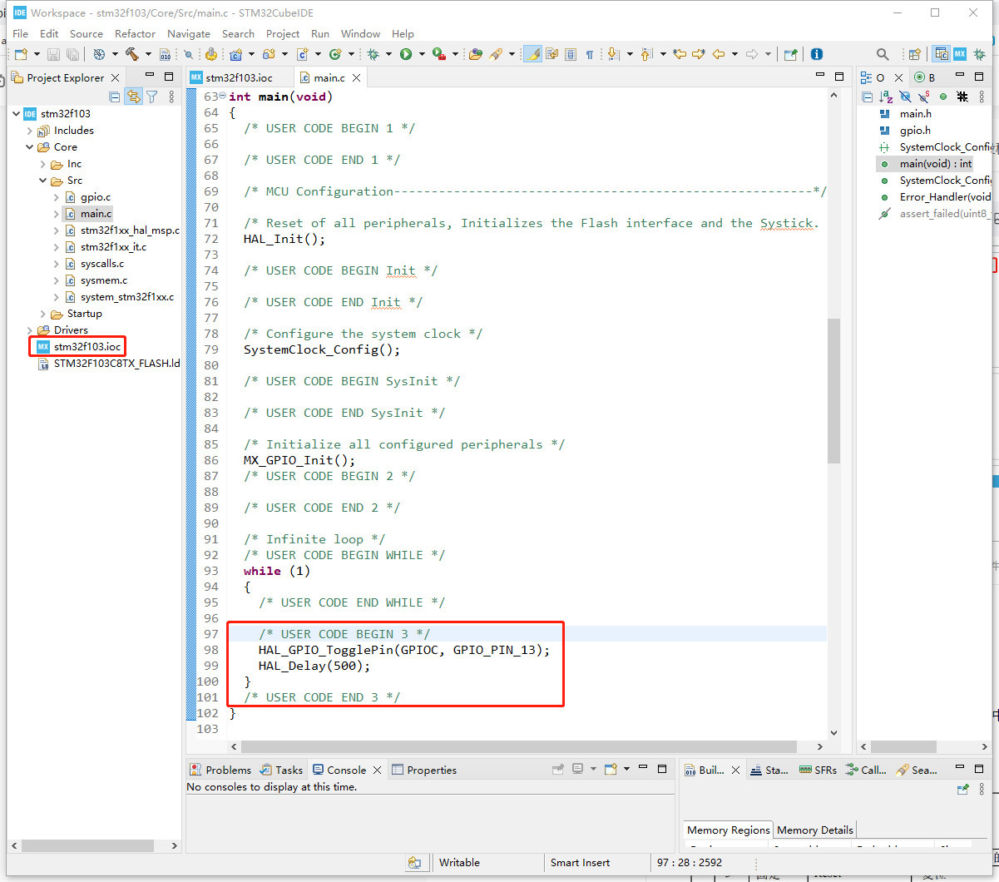

点击Run按钮IDE将自动构建并下载文件到芯片，Debug模式也可以在代码中设置断点调试。Memory Regions窗口会展示空间使用状况，由于使用HAL库，Flash的空间占用了增长到4.59KB。
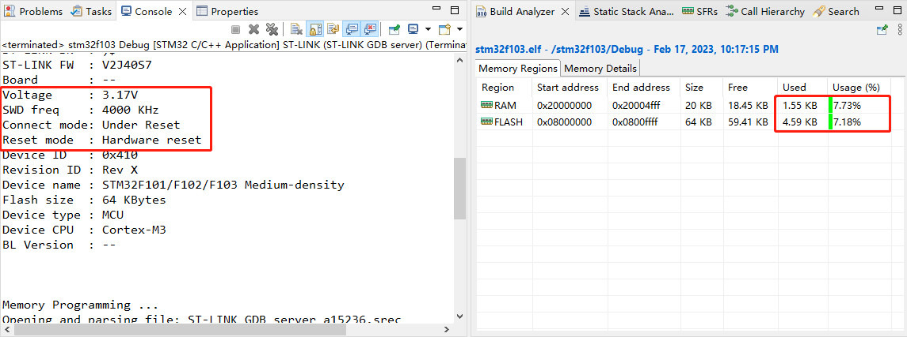

# µC/OS IIII移植
开源、商业化收费，是Micrium公司开发的一款嵌入式实时操作系统，代码规范符合ANSI-C标准，简洁干净非常适合学习。最早出自于1992 年美国嵌入式系统专家Jean J.Labrosse 在《嵌入式系统编程》杂志的文章连载。1998年发布的第二代，通过严格的测试，2000年获得DO-178BA级认证，得到美国联邦航空管理局FAA的认证，可以用在飞行器上。2009年发行第三代，经过了全新的设计，具有高度可移植性，没有任务数目的限制。

官网提供了系统移植例程，这里可以参考STM32F107的

网盘链接：https://pan.baidu.com/s/14qwunKCyeArTFGCYIIizbw  提取码：hadl

- 创建RTOS，将解压后的`uC-CPU`, `uC-LIB`, `uCOS-III` 拷贝进去
- 创建`uC-Config`，将EvalBoards中uCOS-III、BSP下的文件拷贝进去
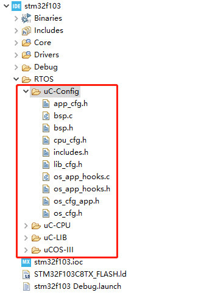

添加RTOS到Source Location
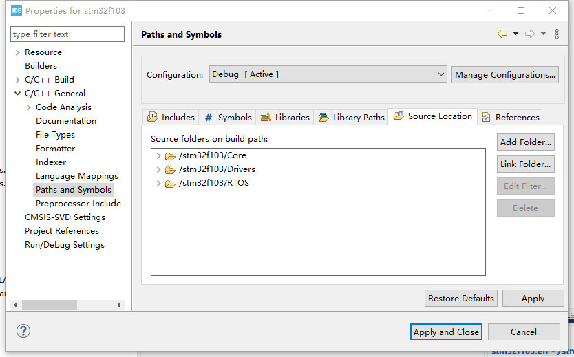

IDE使用gcc编译器进行构建，所以`uC-CPU`、`uC-LIB`、`uCOS-III`目录中`ARM-Cortext-M3`只保留GNU（RealView对应Keil公司的MDK编译器）。其余的可直接删掉，或者右键`Resource Configurations / Exclude from Build..`
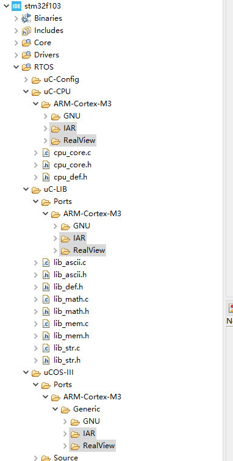

将所有包含代码的目录添加到`Include Paths`
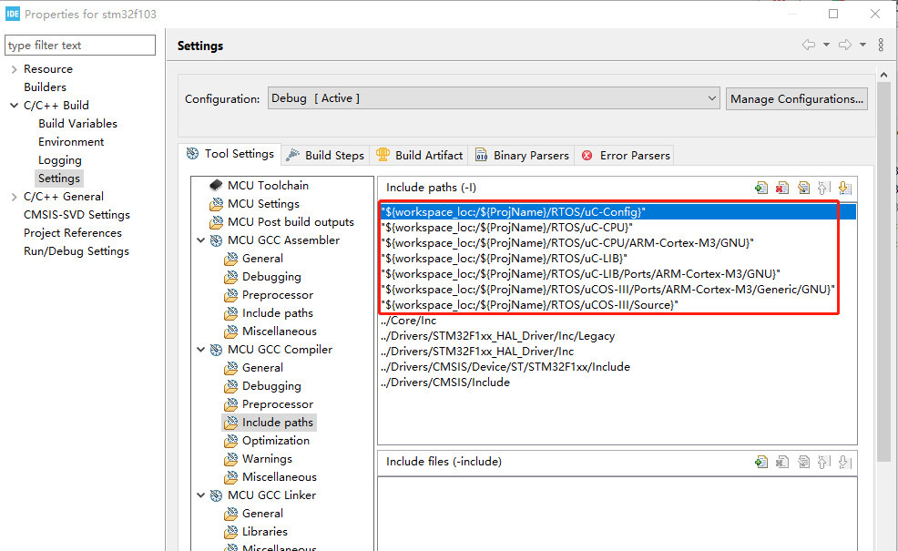

清除`bsp.h`仅保留`cpu.h`的引用
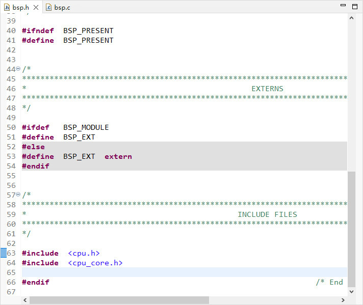

清除`bsp.c`的无效内容
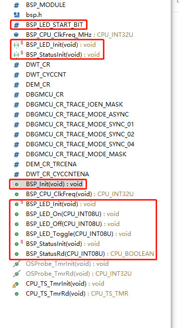

使用`Ctrl+B`进行尝试编译，此时剩下`BSP_CPU_ClkFreq`报错。引用`stm32f1xx_hal.h`后重写该方法，使用`HAL_RCC_GetHCLKFreq`获取HCLK时钟频率
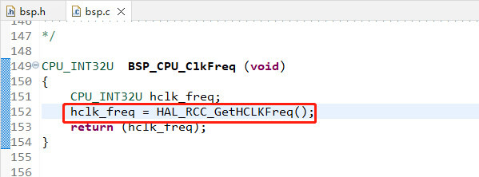

修改`Core/Src/stm32f1xx_it.c`，激活OS的系统时钟。此处的`HAL_IncTick`用于激活HAL库的时间函数，比如`HAL_Delay`
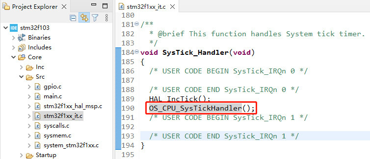

修改`uCOS-III/Ports/ARM-Cortex-M3/Generic/GNU/os_cpu_a.s`的38、133行，将所有`OS_CPU_PendSVHandler`改名为`PendSV_Handler`。本质是使用ucOS的PendSV替换掉默认的
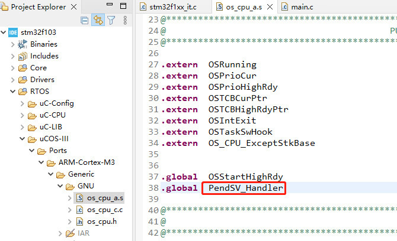

注释掉`stm32f1xx_it.c`中的`PendSV_Handler`
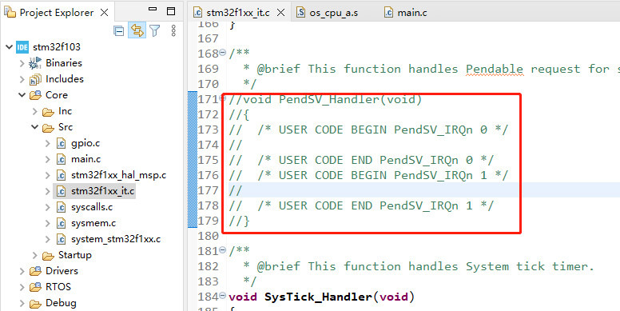

使用uCOS提供的函数重写main方法
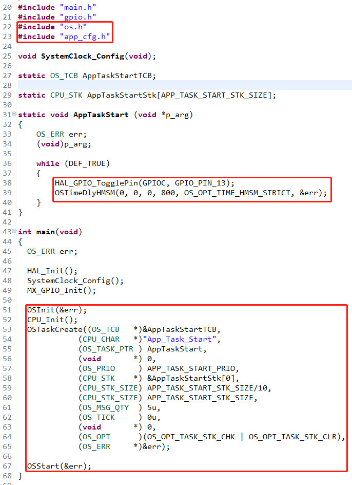

重新编译后下载，uCOS可以正常运行。

# FreeRTOS
开源、免费，2003年由Richard Barry创建，是除Linux以外最受欢迎的嵌入式操作系统。2017年作者加入亚马逊担任首席工程师，FreeRTOS也由亚马逊管理，商业化版本为OpenRTOS。
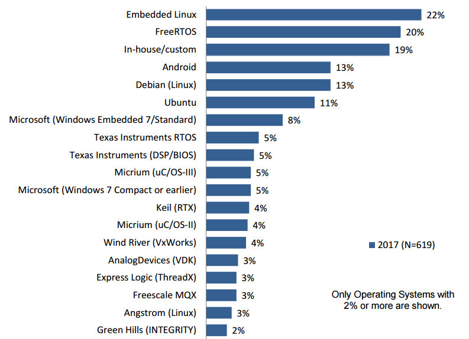

从https://github.com/FreeRTOS/FreeRTOS-Kernel 获取系统源码。将FreeRTOS下的文件、`include`、`portable`下的`GCC/ARM_CM3`和`MemMang`拷贝到新建的RTOS源码目录；MemMang下每个文件代表不同的内存管理方式，这里选用`heap_2`方式。
将`FreeRTOS\Demo\CORTEX_STM32F103_GCC_Rowley\FreeRTOSConfig.h`拷贝到`include`目录。
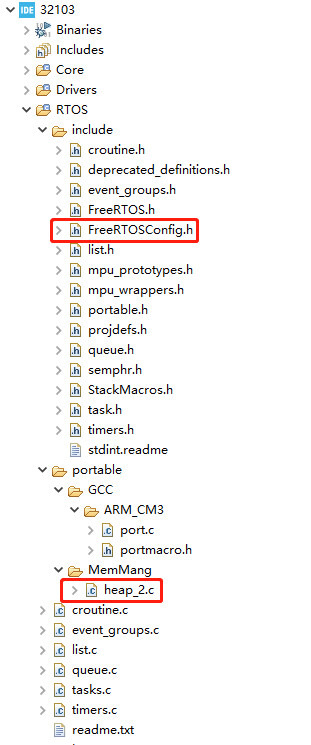

添加到构建路径中
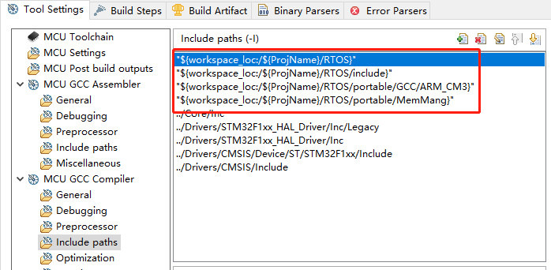

使用FreeRTOS的`xPortPendSVHandler`、`vPortSVCHandler`并替换默认的异常`Handler`。此处`configTOTAL_HEAP_SIZE`代表堆可用RAM总量，无需大内存时可调小。
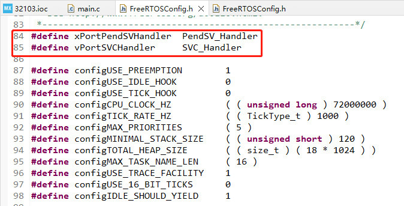

注释掉默认的`PendSV_Handler`、`SVC_Handler`，并在`SysTick_Handler`中启动RTOS心跳
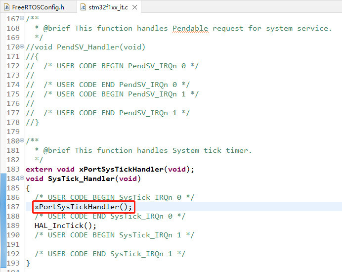

编写测试程序以验证是否移植成功。
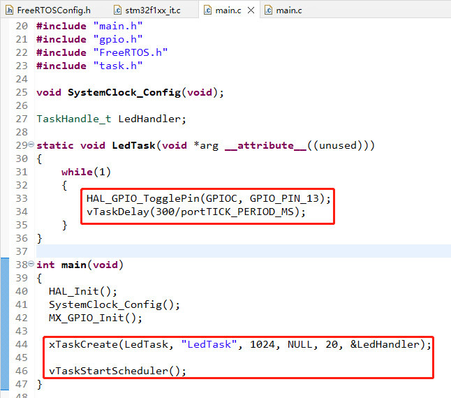

# 串口通信
在项目配置中可以通过启用USART1进行串口通信，对应PA9、PA10管脚生效，并生成`usart.h`和`usart.c`文件
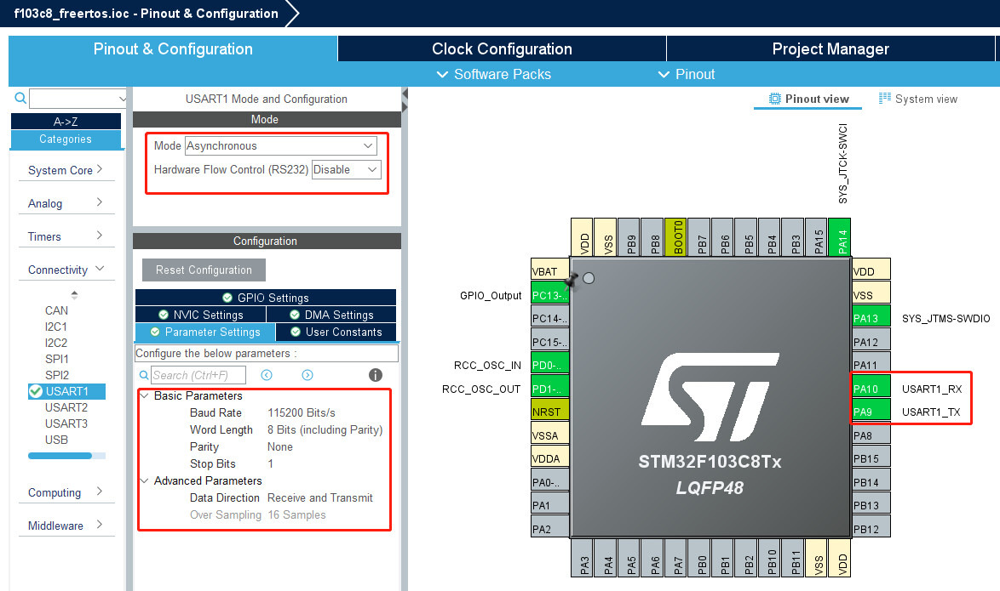

重定义底层实现，将printf函数的数据内容通过husart1串口发送出去。
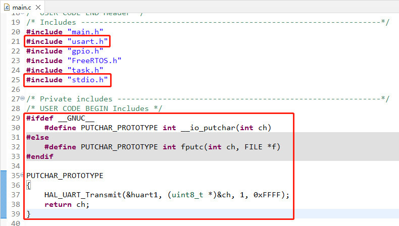

效果如下
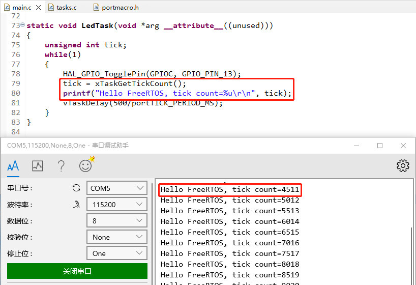
