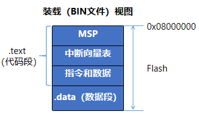

+++
date = '2023-12-04T00:00:00+08:00'
title = 'RTOS实现原理'
tags = ["rtos","stm32"]
+++
# 目的
为什么会有这篇文章？
首先是好奇。月亮为什么会有盈缺？苹果为什么会落下？烧开水的壶盖为什么会跳动？无线电为什么会传播？正是因为好奇，人类才从洞穴走向了宇宙深空。好奇心是人类的基本特征，是追求进步、推动创新的源动力。记得有一道经典的面试题：浏览器输入URL后会车发生了什么？同样，在我们生活之中有各种类似的问题，当用手机扫描共享单车完成支付后，锁是怎么打开的？当把燃气充值卡后插入表中，发生了什么？

其次是有用。计算机归根结底是一门应用学科，当我们在准备掌握一门新技术时，总会想到一个问题：有什么用。掌握编程语言让我们知道如何编写逻辑，掌握数据结构有助于更好地组织逻辑，其中最重要且复杂的要数操作系统。每一位有想法的计算机专业学生，都把写一个编译器或操作系统作为自己的终极目标或专业能力试金石。比如Linus在1997年的硕士毕业论文，题目就是《Linux: A Portable Operating System》。但当我们真正深入操作系统时不免会遇到重重困难：要么是书厚、代码多、门槛高；又或是时代久远，各种硬件环境、工具链资料缺失，难以复现；又或者是从xv6或30天系列入手，学完后遇到另一个问题“有什么用”。而学习RTOS就很好的避开了上述问题，不仅代码量少上手容易，迅速理解操作系统的工作原理；又能紧跟时代，获取到最新的硬件和技术资料；而且还能和实际生活应用联系起来。比如北京在20年治理雾霾过程中的空气质量监测，疫情期间公共场合的人体温度红外识别；记得B站上看过一个纪录片，福岛核事故后续，几位退休人员组成的民间团体，拿着自制的辐射检测仪深入街道、学校、树林检测环境的危害程度，来标记安全的活动区域，令人印象深刻。
# 发展历程
我们将从计算机发展史开始，快速理解各种词汇的含义，并进一步认识微控制器和RTOS在现代技术领域中的定位。

- 1969年12月，CTC计算机终端公司是一家使用TTL制造8位处理器生产电传打印机的公司，位于德克萨斯州，由NASA前工程师Gus Roche和Phil Ray在1968年创立。在开发Datapoint 2200时，为了减少处理器尺寸和发热量，咨询Intel能否采用单芯片的方案。德州仪器的销售人员听说此事后，也争取到了这份订单。
- 1971年6月，德州仪器率先公布TMX1795，第一款8位处理器，但由于空间浪费并未被采纳；而Intel的芯片直到年底才就绪，同样未被采纳；CTC采用开关电源解决了发热问题，并继续使用TTL制造处理器。
- 1971年11月，Intel发布第一款4位单芯片处理器4004，又称MCS-4，主频108~740KHz，内部由四个集成电路（IC）组成，由Federico Faggin、Stan Mazor和Ted Hoff三位工程师设计，提供给日本公司Busicom用来生产电子计算器。通过让出6万美元的研发费用，Intel拥有了4004的所有权。
- 1972年4月，Intel发布了8位处理器8008，又称MCS-8，频率0.5/0.8MHz，14位地址支持16KB内存、支持中断处理。由于当初CTC放弃该芯片时没有支付足够的研发费用，双方达成协议，Intel获得了芯片所有权以及CTC开发的指令集，并在两年后将其商业化，该指令集成为x86指令的基础。
- 1974年3月，Motorola推出MC6800，以PDP-11的处理器为结构模板，时钟可达1~2MHz，16位地址可直接访问64KB内存。6月，惠普开发出基于6800的系统原型机；直到11月，M6800微机系统才投产。Motorola采用和8080同样的售价，高达360美元。由于工厂搬迁、裁员危机、以及公司对研发低成本处理器的消极态度，8月，研发人员Chuck Peddle和其他五名工程师离开后，加入了宾夕法尼亚州的MOS科技，该公司主要为德州仪器和雅达利做外包。
- 1974年4月，Intel发布8080处理器，做为8008的扩展和增强，时钟频率达到2MHz，由于指令集的原因，实际处理速度不如6800，最初主要用于控制交通信号灯，但很快被用来生产计算机，并成为有史以来最成功的处理器之一。1975年1月，MITS采用8080生产出Altair 8800，成为世界上第一台微型计算机，拥有256字节RAM。在哈佛读书的Bill Gates和Paul Allen为其设计了BASIC编辑器。
- 1974年12月，仙童（Fairchild）推出第一款单片机F8，包含一个8位CPU、64B RAM（其实是两片3850/3851)。
- 1975年9月，MOS科技推出了6502，主频和6800一致，但拥有一条指令流水线，性能更好，售价仅25美元。同时为了帮助电子工程师制作电脑和设备，Peddle还研发了KIM-1开发板，拥有1KB内存。由于6502的出色表现，MOS科技被Commodore收购。由于价格低廉，性能出色，该处理器被广泛应用于家庭电脑、游戏机之中。
- 1976年3月，Steve Wozniak和Steve Jos利用6502搭建出了Apple I的主板，并在4月1日成立Apple公司。
- 1976年7月，Federico Faggin离开Intel成立了Zilog公司并发布Z80处理器，达到2.5MHz，与8080指令兼容。
- 1976年9月，Intel推出8位单片机MCS-48系列，内部包含1KB ROM、64B RAM，用于制造电视遥控、键盘等。
- 1977年10月，通用仪器（GI）公布了PIC1650单片机，包含512B ROM、32B RAM，用于扩展CP1600（GI和霍尼韦尔联合开发的16位处理器）的IO功能，后拆分成为Microchip公司。
- 1978年6月，Intel推出第一款16位处理器 8086，主频4.43MHz，24位地址总线寻址范围达到1MB。
- 1978年12月，Hermann Hauser和Chris Curry在英格兰剑桥创办了Camberidge Processor Unit Ltd.主营电子设备设计和制造业务。在1979年3月发明「Acorn System 1」，使用6502处理器，并将公司改名为Acorn。
- 1979年6月，Intel推出8088，主频达到5~10MHz，并成功被IBM采用，作为个人电脑的处理器。
- 1980年，Intel推出MCS-51单片机，内含4KB ROM，128B RAM，最初被用作IBM PC的键盘控制器。
- 1981年12月，Acorn推出BBC Micro计算机，成为欧洲第一台畅销的个人计算机。并在之后开始设计一种类似高级6502架构的处理器。
- 1982年，Intel推出16位单片机MCS-96系列，主频达到12MHz、8K ROM以及232B RAM，支持8级中断。
- 1985年4月，Acorn公司团队研发出采用精简指令集的新处理器Acorn RISC Machine，又称ARM1，采用32位精简指令集，26位地址总线可寻址64M空间，但主频只有6MHz。
- 1985年10月，Intel推出32位处理器80386，主频达到12.5-40MHz，32位地址总线可以寻址4G内存。
- 1990年11月，为了更好地发展ARM，Acorn公司的12名员工接受了苹果和VLSI的投资，成立合资公司ARM，同时更改了产品策略：只负责设计，不再负责生产制造和出售，以降低研发成本和风险。
- 1993年，ARM发布ARM6内核，作为ARM2和ARM3的改进版，授权给Cirrus Logic和德州仪器。同年苹果推出了的掌上电脑Newton，使用了ARM6的芯片。
- 1997年，Nokia6110发布，基于ARM7TDMI内核处理器。
- 2004年，ARM发布Cortex-M3内核，在ARM11后，放弃了ARMx的命名方式，并采用A、R、M系列，分别对应高性能、高实时性和微控制器场合。
- 2007年，第一款iPhone发布，搭载Samsung生产的S5L8900，基于ARM11内核。
- 2010年3月，任天堂在E3 2010发布了3DS，采用ARM11 MP双核和ARM9处理器。
- 2017年3月，任天堂发布了Switch掌机，采用Nvidia Tegra X1处理器，基于Cortex-A57、Cortex-A53核心。
- 2020年11月，苹果发布第一款基于ARM架构的自研处理器Apple M1，采用ARMv8-A指令集架构。
- 2021年11月，富士通基于A64FX处理器打造的超级计算机“富岳”蝉联超算第一，采用ARMv8.2-A架构

早期单片机多用于外设接口控制器，服务于处理器系统， 随着芯片工艺不断改进，集成度和运算能力不断提升，微控制器也获得广泛的应用和发展。目前，比较常见的单片机有

| 类型 | 简介 | 厂商举例 | 
| --- | --- | --- |
| 51系列 | 1980年由Intel研发的8位微型计算机系统，采用CISC指令集、冯诺依曼结构。因90年代致力于研制和生产微机CPU，将MCS-51核心技术授权给其他半导体公司。由于其结构合理、技术成熟，得到广泛的应用，成为一代经典。 | Atmel的AT89、Philips的80C51、宏晶的STC |
| MSP430 | 1993年由德州仪器推出的16位混合信号处理器，采用RISC指令集、冯诺依曼结构。由于具有低电压、低功耗等特点，以及良好的抗干扰和可靠性，被广泛应用在智能家居、汽车电子、医疗器械、工业自动化等领域。| TI | 
| PIC系列 | 1993年由微芯科技推出的8位外设接口控制器，最早由通用仪器（GI）在1985年设计，采用RISC指令集、哈佛结构。由于采用双总线结构，运行速度快。后续也有16位、32位系列。|Microchip | 
| AVR | 1997年由Atmel公司挪威设计中心的Alf-Egil和Vegard研发的8位单片机，采用RISC指令集、哈佛结构，性价比高。2016年，被Microchip收购。Arduino采用的就是Atmega系列 | Atmel | 
| ARM系列 | 1990年成立于英格兰剑桥，由ARM公司（Advanced RISC Machine）研发的32位单片机、同时支持16位Thumb指令，ARM11之后采用全新的ARMv7架构，产品线更名为Cortex系列，ARMv8增加了AArch64架构，支持64位处理。由于采用专注设计、授权制造的策略，成为市场主流。| ST、Microchip、NXP兆易的GD32 |

时至今日，51系列的由于技术架构原因性能上全面落后于后出现的RISC指令集，但由于价格便宜，依然活跃在各类产品中。曾经有段时间因为STM32芯片缺货涨价，导致大量公司将产品换成了国产的GD32，如大疆的无人机。任意一款处理器，只要在特定领域满足性能指标后，价格、功耗就成为最重要的因素，参照6502的故事。

# 硬件基础
这里我们以ARM为例做进一步详解。

ARM代表了一种芯片标准，体现了芯片的架构设计，而具体涉及到存储器容量，片上外设，IO引脚数等实现，则是由不同的芯片厂商进行设计的，比如当前最主流的STM32芯片，它是由ARM公司提供内核，意法半导体公司（ST）基于此内核进行设计的。


- M0、M0+、M1采用ARMv6架构
- Cortex-M3开始采用ARMv7架构，内部数据总线、寄存器、存储器均为32位，如STM32F1系列。
- Cortex-M4在M3基础上增加了DSP指令，强化了浮点运算，以适应数字信号处理，如STM32F4系列。

## 总线结构
芯片内核与外设之间通过各种总线连接，基于AHB（Advanced High performance Bus 高级高性能总线）和APB（Advanced Peripheral Bus 高级外设总线）。内核总线包括

- ICode 指令总线，编译后的程序下载存放在Flash中，通过该总线取出执行。
- DCode 数据总线，代码中的变量存放在SRAM中，通过该总线进行访问。
- System 系统总线，用于寄存器的读写。
- DMA 总线，用于外设之间的数据传输，如寄存器、SRAM、Flash等。
- APB 外设总线，AHB通过总线桥与两个APB进行同步连接。GPIO、串口、I2C、SPI等设备都挂载这两条总线上。如何编程去设置、驱动这些外设，是学习的重点。


## 内存结构
Cortex-M系列不带MMU（内存管理单元），所有的寄存器、存储空间和设备端口均通过绝对地址访问。32位对应的4G空间被划分成固定的几个区域，该布局规范由ARM公司统一设计，厂商不能更改。主要包括Code、SRAM、片上外设、FMC、核外设区。其中需要特别注意的：

- RAM 地址从`0x2000 0000`开始，用于运行时堆栈，即SP值
- Flash 地址从`0x0800 0000`开始，用于存放程序代码，即PC值


## 启动过程
参考《The Definitive Guide To ARM Cortex M3》3.7 RESET SEQUENCE章节。STM32支持三种启动模式，可通过设置BOOT管脚进行选择。当选用Flash启动时，0x0800 0000 将映射到 0x0000 0000，即二者等效。

芯片上电后，将从`0x0000 0000`读取第1个字作为栈顶地址（SP），从`0x0000 0004`读取第2个字作为第一条指令地址（PC）。

栈增长方向由上到下（先压栈后访问），所以SP初始值应该是栈顶上的第一个地址，比如将`0x2000 7C00`到`0x2000 7FFF`的空间作为栈，SP初始值应该设为`0x2000 8000`。

## GPIO结构
STM32数据引脚一律采用通用输入输出IO接口，全称General Purpose Input Ouput，通过编程设置，使每个引脚既可以作为输入、也可以作为输出端口使用。如F103ZET6拥有A到G共7组端口，每组16个IO口，共112个引脚可用。


通过设置相应的寄存器，选择是否启用、输入输出模式，以达到节能、端口复用的目的。参考上图，GPIO支持8种配置模式：

- `GPIO_Mode_AIN` 模拟输入，用于采集模拟量（电压值）
- `GPIO_Mode_IN_FLOATING` 浮空输入，输入完全由外部控制，适用于数据通信（如串口接收RX）
- `GPIO_Mode_IPD` 下拉输入，内部接下拉电阻，若外部无信号，默认为低电平
- `GPIO_Mode_IPU` 上拉输入，内部接上拉电阻，若外部无信号，默认为高电平
- `GPIO_Mode_Out_OD` 开漏输出，相当于三极管的集电极，要得到高电平需要上拉电阻，适用于外部电流驱动
- `GPIO_Mode_Out_PP` 推挽输出，可输出高、低电平、连接外设
- `GPIO_Mode_AF_OD` 复用开漏输出，与开漏输出类似，数据来自片上外设（如I2C的SCL、SDA
- `GPIO_Mode_AF_PP` 复用推挽输出，与推挽输出类似，数据来自片上外设（如串口发送TX）

每个端口对应7个寄存器

- 两个配置寄存器 `GPIOx_CRL`, `GPIOx_CRH` 选择引脚功能，设置输入输出模式
- 两个数据寄存器 `GPIOx_IDR`, `GPIOx_ODR` 保存输出输出电平
- 两个位控制寄存器 `GPIOx_BSRR`, `GPIOx_BRR` 设置引脚为1或0
- 锁定寄存器 `GPIOx_LCKR` 锁定配置，不允许修改

# 开发基础
在理解了启动过程和GPIO模式之后，这里使用STM32F103C8T6核心板（也称BluePill）为例，描述程序的执行过程。BOOT0选择跳线置0，选择从Flash启动。


板上有两个LED，右侧为电源指示灯，左侧对应PC13端口，根据电路图定义可知
- 上电后VCC高电平，电源灯亮起
- 当PC13为0时，LED2导通，指示灯亮起；交替设置为1或0，就能控制LED2闪烁


## 基本原理
具体代码可参考 https://github.com/firebat/stm32-tutorial/tree/master/1_blink

由于STM32F103x8系列仅有64K的Flash和20K的SRAM，所以栈顶指针最大不能超过`0x20005000`，这里以4K为例。通过__asm__语法内嵌汇编来设置初始化SP、PC取值。
```C
// STM32F103C8T6 only has a 20k SRAM, so MSP must be less than 0x20005000.
// For example, stack size = 0x20001000-0x20000000 = 0x1000 = 4K, that's enough.
__asm__(".word 0x20001000");
__asm__(".word main");
```
通过查找《STM32F1技术手册(RM0008)》找到对应的控制寄存器地址，GPIOC相关寄存器范围在 `0x4001 1000 ~ 0x4001 13FF`
```C
/*
  STM32F10x Reference manual (RM0008)
  -----------------------------------
  3.3 Memory map

            Table 3. Register boundary addresses
  +---------------------------+-------------------------+
  |     Boundary address      |         Peripheral      |
  +---------------------------+-------------------------+
  |           .....           |              .....      |
  +---------------------------+-------------------------+
  | 0x4002 1000 - 0x4002 13FF | Reset and clock control |
  +---------------------------+-------------------------+
  |           .....           |            .....        |
  +---------------------------+-------------------------+
  | 0x4001 1000 - 0x4001 13FF | GPIO Port C             |
  +---------------------------+-------------------------+
  |           .....           |            .....        |
  +---------------------------+-------------------------+
 */
#define GPIOC_CRH    (*((volatile unsigned long*)(0x40011000 + 0x4)))
#define GPIOC_BSRR   (*((volatile unsigned long*)(0x40011000 + 0x10)))
#define RCC_APB2ENR  (*((volatile unsigned long*)(0x40021000 + 0x18)))
```
首先，设置`RCC_APB2ENR`启用外设时钟，使`IOPCEN`位为1，启用C端口。
```C
  // -------------------------------------
  // Enable GPIO_C
  /*
    GPIO(General Purpose I/O) must be ENABLED before use, else it will be disabled for
    a lower power cost, which is controlled by RCC_APB2ENR(APB2 peripheral clock enable register).


    STM32F10x Reference manual (RM0008)
    -----------------------------------
    7.3.7 APB2 peripheral clock enable register (RCC_APB2ENR)
          Address: 0x18
          Reset value: 0x0000 0000

      31    30    29    28    27    26    25    24    23    22    21    20    19    18    17    16
    +-----------------------------------------------------------+-----+-----+-----+-----------------+
    |                                                           |TIM11|TIM10| TIM9|                 |
    |                           Reserved                        | EN  | EN  |  EN |     Reserved    |
    |                                                           |-----+-----+-----|                 |
    |                                                           | rw  | rw  | rw  |                 |
    +-----------------------------------------------------------+-----+-----+-----+-----+-----+-----+
      15    14    13    12    11    10     9     8     7     6     5     4     3     2     1     0
    +-----+-----+-----+-----+-----+-----+-----+-----+-----+-----+-----+-----+-----+-----+-----+-----+
    | ADC3|USART| TIM8| SPI1| TIM1| ADC2| ADC1| IOPG| IOPF| IOPE| IOPD| IOPC| IOPB| IOPA|     | AFIO|
    |  EN |  EN |  EN |  EN |  EN |  EN |  EN |  EN |  EN |  EN |  EN |  EN |  EN |  EN | Res.|  EN |
    +-----+-----+-----+-----+-----+-----+-----+-----+-----+-----+-----+-----+-----+-----|     |-----+
    |  rw |  rw |  rw |  rw |  rw |  rw |  rw |  rw |  rw |  rw |  rw |  rw |  rw |  rw |     |  rw |
    +-----+-----+-----+-----+-----+-----+-----+-----+-----+-----+-----+-----+-----+-----+-----+-----+ 
  */

  // - IOPCEN = 1
  RCC_APB2ENR = (1 << 4);
  ```
  设置`GPIOx_CRH`高位配置寄存器（偏址`0x04`），配置推挽输出模式，直接给LED供电。
  ```C
  // -------------------------------------
  // Configure PC_13
  /*
    Each of the general-purpose I/O ports has two 32-bit configuration registers (GPIOx_CRL,
    GPIOx_CRH), two 32-bit data registers (GPIOx_IDR, GPIOx_ODR), a 32-bit set/reset
    register (GPIOx_BSRR), a 16-bit reset register (GPIOx_BRR) and a 32-bit locking register
    (GPIOx_LCKR).

    STM32F10x Reference manual (RM0008)
    -----------------------------------
    9.2.2 Port configuration register high (GPIOx_CRH) (x=A..G)
          Address offset: 0x04
          Reset value: 0x4444 4444

      31    30    29    28    27    26    25    24    23    22    21    20    19    18    17    16
    +-----+-----+-----+-----+-----+-----+-----+-----+-----+-----+-----+-----+-----+-----+-----+-----+
    | CNF15[1:0]|MODE15[1:0]| CNF14[1:0]|MODE14[1:0]| CNF13[1:0]|MODE13[1:0]| CNF12[1:0]|MODE12[1:0]|
    +-----+-----+-----+-----+-----+-----+-----+-----+-----+-----+-----+-----+-----+-----+-----+-----|
    |  rw |  rw |  rw |  rw |  rw |  rw |  rw |  rw |  rw |  rw |  rw |  rw |  rw |  rw |  rw |  rw |
    +-----+-----+-----+-----+-----+-----+-----+-----+-----+-----+-----+-----+-----+-----+-----+-----+ 
      15    14    13    12    11    10     9     8     7     6     5     4     3     2     1     0
    +-----+-----+-----+-----+-----+-----+-----+-----+-----+-----+-----+-----+-----+-----+-----+-----+
    | CNF11[1:0]|MODE11[1:0]| CNF10[1:0]|MODE10[1:0]| CNF9[1:0] | MODE9[1:0]| CNF8[1:0] | MODE8[1:0]|
    +-----+-----+-----+-----+-----+-----+-----+-----+-----+-----+-----+-----+-----+-----+-----+-----+
    |  rw |  rw |  rw |  rw |  rw |  rw |  rw |  rw |  rw |  rw |  rw |  rw |  rw |  rw |  rw |  rw |
    +-----+-----+-----+-----+-----+-----+-----+-----+-----+-----+-----+-----+-----+-----+-----+-----+ 
   */

  // - CNF13[1:0] = 00 (General purpose output push-pull)
  // - MODE[1:0]  = 01
  GPIOC_CRH = 0x44144444;
```
通过`BSRR`端口位设置/清除寄存器（偏址`0x10`）的`BR13/BS13`位，使PC13输出高低电位。
```C
  // Light on/off
  /*
    STM32F10x Reference manual (RM0008)
    -----------------------------------
    9.2.5 Port bit set/reset register (GPIOx_BSRR) (x=A..G)
          Address offset: 0x10
          Reset value: 0x0000 0000

      31    30    29    28    27    26    25    24    23    22    21    20    19    18    17    16
    +-----+-----+-----+-----+-----+-----+-----+-----+-----+-----+-----+-----+-----+-----+-----+-----+
    | BR15| BR14| BR13| BR12| BR11| BR10| BR9 | BR8 | BR7 | BR6 | BR5 | BR4 | BR3 | BR2 | BR1 | BR0 |
    +-----+-----+-----+-----+-----+-----+-----+-----+-----+-----+-----+-----+-----+-----+-----+-----|
    |  w  |  w  |  w  |  w  |  w  |  w  |  w  |  w  |  w  |  w  |  w  |  w  |  w  |  w  |  w  |  w  |
    +-----+-----+-----+-----+-----+-----+-----+-----+-----+-----+-----+-----+-----+-----+-----+-----+ 
      15    14    13    12    11    10     9     8     7     6     5     4     3     2     1     0
    +-----+-----+-----+-----+-----+-----+-----+-----+-----+-----+-----+-----+-----+-----+-----+-----+
    | BS15| BS14| BS13| BS12| BS11| BS10| BS9 | BS8 | BS7 | BS6 | BS5 | BS4 | BS3 | BS2 | BS1 | BS0 |
    +-----+-----+-----+-----+-----+-----+-----+-----+-----+-----+-----+-----+-----+-----+-----+-----+
    |  w  |  w  |  w  |  w  |  w  |  w  |  w  |  w  |  w  |  w  |  w  |  w  |  w  |  w  |  w  |  w  |
    +-----+-----+-----+-----+-----+-----+-----+-----+-----+-----+-----+-----+-----+-----+-----+-----+ 
   */


  // - ON : BR13 = 1
  // - OFF: BS13 = 1
  while(1) {
    GPIOC_BSRR = (1 << 29);
    for(i=0; i<500000; i++);
    GPIOC_BSRR = (1 << 13);
    for(i=0; i<500000; i++);
  }
```
使用`arm-none-eabi-gcc`编译以上代码，生成`main.bin`。
```Makefile
PREFIX := arm-none-eabi-
.PHONY: all clean

all: main.bin

main.o: main.c
	$(PREFIX)gcc -mcpu=cortex-m3 -mthumb -nostartfiles -c main.c -o main.o

main.elf: main.o simple.ld
	$(PREFIX)ld -T simple.ld -o main.elf main.o

main.bin: main.elf
	$(PREFIX)objcopy -j .text -O binary main.elf main.bin

clean:
	rm -f *.o *.elf *.bin
```
链接文件内容如下，即将代码段放到`0x0`的起始位置。
```linker-script
SECTIONS {
    . = 0x0;
    .text : {
        *(.text)
    }
}
```
## 下载烧录
代码下载有多种仿真器可选，如德国SEGGER公司的JLink，ST意法半导体的STLink，以及开源的DAPLink（带SWD和串口，推荐）。这里选用STLink为例，核心板支持4针的SWD协议（Serial Wire Debugging 串口调试接口），按照定义连接对应的端口即可：VCC、GND、SWDCLK、SWDIO。


使用STLinkUtility等工具，将`main.bin`下载到Flash中，由于没有引用任何外部代码库，文件只有108字节。其中
- 0-3字节`2000 1000`定义了栈顶SP取值。由于代码中仅1个变量，该值可以更小
- 4-7字节`0000 0009`定义了第一条指令PC取值，即两条`__asm__`代码后面的`main`

下载完成后，按下核心板的Reset按键，就可以看到PC13在不停的闪烁。


## 开发工具
常见的开发工具有多种选择

Keil MDK 编译器armcc效率高、生成代码更小、仿真模拟器优秀；收费，还很贵。
STM32CubeIDE 意法半导体基于Eclipse开发，使用gcc编译，支持配置生成代码和调试，免费。
VSCode 根据自身需要，选取合适的编译器(armcc、gcc)和构建工具(cmake、scons)。

## 开发库
CMSIS Common Microcontroller Software Interface Standard是ARM公司制定的一个标准，提供了与芯片生产商无关的硬件抽象层。主要包含一些寄存器地址、数据结构定义、编译器相关的启动配置。
HAL Hardware Abstraction Layer 是ST公司为STM32的MCU最新推出的抽象层嵌入式软件，为更方便的实现跨STM32产品的最大可移植性。

这些开发库大大降低了开发难度，代码简洁易读且方便移植。如果使用HAL编写上面LED闪烁代码，看起来会是这样
```C
#include "stm32f1xx_hal_conf.h"

// HAL_Delay 依赖系统时钟，需提前初始化，并在SysTick中断中调用HAL_IncTick
while(1)
{
    HAL_GPIO_WritePin(GPIOC, GPIO_PIN_13, GPIO_PIN_RESET);
    HAL_Delay(500);
    HAL_GPIO_WritePin(GPIOC, GPIO_PIN_13, GPIO_PIN_SET);
    HAL_Delay(500);
}

// 或 
while(1)
{
    HAL_GPIO_TogglePin(GPIOC, GPIO_PIN_13);
    HAL_Delay(500);
}
```

## 文件结构
首先我们看一下编译后的文件结构

- ELF文件，代码编译后，首先会生成ELF文件，包含大量的调试信息，如文件头、段描述等，实际运行并不需要
- BIN文件，截取ELF文件中的代码、数据，作为可执行文件下载到Flash中
- 运行阶段，系统启动时，首先将Flash中的.data段复制到SRAM中，初始化相应的堆栈和.bss段，之后再跳转到用户的main函数执行。

最终用于下载到Flash中的文件结构如下。

这里，可以计算得出，生成文件执行的最小资源需求
- `Flash` = `Code（代码）` + `RO-data（常量）` + `RW-data（已初始化可读写）`
- `RAM` = `RW-data（已初始化可读写）` + `ZI-data（未初始化可读写）`

## 启动分析
编译阶段，通过链接脚本和启动文件，生成了可运行的BIN文件。在CMSIS对应的编译器目录可以找到下启动文件`startup_stm32f10x_md.s`，其中定义了.isr_vector段，开头部分包括两个值

- `_estack` 栈顶地址，参考ld文件中定义
- `Reset_Handler`入口函数
```linker-script
    .section    .isr_vector,"a",%progbits
    .type   g_pfnVectors, %object
    .size   g_pfnVectors, .-g_pfnVectors

g_pfnVectors:
    .word   _estack
    .word   Reset_Handler
    .word   NMI_Handler
    .word   HardFault_Handler
```
链接脚本参考样本工程中的 [STM32F103XB_FLASH.ld](https://github.com/STMicroelectronics/STM32CubeF1/blob/v1.8.5/Drivers/CMSIS/Device/ST/STM32F1xx/Source/Templates/gcc/linker/STM32F103XB_FLASH.ld) （拥有128K Flash、20K SRAM）。通过`SECTIONS`定义
- 将`isr_vector`向量表放到FLASH区；启动时`_estack`恰好处在`0x0000 0000`地址
- 将`.data`数据段到RAM区；但启动前通过AT将其放到FLASH区，启动时需从FLASH加载到RAM
```linker-script
/* Entry Point */
ENTRY(Reset_Handler)

/* Highest address of the user mode stack */
_estack = 0x20004FFF;    /* end of RAM */

/* Generate a link error if heap and stack don't fit into RAM */
_Min_Heap_Size = 0x200;      /* required amount of heap  */
_Min_Stack_Size = 0x400; /* required amount of stack */

/* Specify the memory areas */
MEMORY
{
  FLASH (rx)      : ORIGIN = 0x08000000, LENGTH = 128K
  RAM (xrw)       : ORIGIN = 0x20000000, LENGTH = 20K
}

/* Define output sections */
SECTIONS
{
  /* The startup code goes first into FLASH */
  .isr_vector :
  {
    . = ALIGN(4);
    KEEP(*(.isr_vector)) /* Startup code */
    . = ALIGN(4);
  } >FLASH
  ...
    /* used by the startup to initialize data */
  _sidata = LOADADDR(.data);

  /* Initialized data sections goes into RAM, load LMA copy after code */
  .data : 
  {
    . = ALIGN(4);
    _sdata = .;        /* create a global symbol at data start */
    *(.data)           /* .data sections */
    *(.data*)          /* .data* sections */

    . = ALIGN(4);
    _edata = .;        /* define a global symbol at data end */
  } >RAM AT> FLASH
```
下面看一下复位阶段的处理逻辑，主要功能：

- 将数据段从FLASH加载到RAM，将`LMA（Load Memory Address）`转变为`VMA（Virtual Memory Address）`
- 将未初始化数据置0
```asm
    .section    .text.Reset_Handler
    .weak   Reset_Handler
    .type   Reset_Handler, %function
Reset_Handler:

  /* 将数据段从Flash复制到SRAM */
  movs  r1, #0                    ; 将r1置0, 数据偏移量
  b LoopCopyDataInit

CopyDataInit:                    ; 循环读取sidata + r1 的数据送到_sdata + r1
    ldr r3, =_sidata
    ldr r3, [r3, r1]
    str r3, [r0, r1]
    adds    r1, r1, #4           ; r1 = r1 + 4
    
LoopCopyDataInit:
    ldr r0, =_sdata
    ldr r3, =_edata
    adds    r2, r0, r1
    cmp r2, r3
    bcc CopyDataInit             ; 若sdata + r1 < edata 继续拷贝
    ldr r2, =_sbss               ; r2 = _sbss
    b   LoopFillZerobss

    /* 将sbss与ebss之间清零 */
FillZerobss:
    movs    r3, #0
    str r3, [r2], #4             ; 将r2位置的数据清零, 且r2 = r2 + 4
    
LoopFillZerobss:
    ldr r3, = _ebss
    cmp r2, r3
    bcc FillZerobss              ; 若 r2 < ebss 继续清零
    /* 调用系统初始化，设置系统时钟，位于CMSIS的system_stm32f10x.c中*/
    bl  SystemInit
    /* 进入用户函数*/
    bl  main
    bx  lr
```
通过上述启动过程，设置栈区、中断向量表、初始化数据区和变量，通过标准库中的`SystemInit`函数初始化系统时钟（位于`CMSIS/CM3/DeviceSupport/ST/STM32F10x/system_stm32f10x.c`），之后进入用户代码main函数。

# RTOS
实时操作系统最大的特点是“实时性”，不追求任务完成的效率，而追求任务必须在规定时间内得到响应。常见比较知名的实时操作系统有:
- QNX 1982年发布，最早用于Intel 8088，后被黑莓收购，在汽车电子行业应用广泛。
- VxWorks 1987年发布，主要面向航天和军工，如月球、火星探测，战斗机和导弹系统。
- uC/OS 1992年发布，应用广泛，代码质量极高，开源、商业化收费，可用于飞行器控制。 Apache 2.0许可
- RTEMS 1995年开源，最早用于导弹系统，后被欧洲航天局用于航天，不逊于VxWorks。GPL许可
- FreeRTOS 2003年发布，开源，2018年被亚马逊收购，商业化版本为OpenRTOS。MIT许可
- RT-Thread 2006年发布，开源，免费，国产精品，已用于航空航天。Apache 2.0许可
- NuttX 2007年发布，开源，免费，遵循POSIX，2019年由小米推动进入Apache。Apache 2.0许可

此外还有uCLinux、ThreadX、MbedOS、LiteOS等不一一列举。

## 寄存器
聊操作系统，就无法避开寄存器。CM3含有16个32位寄存器：R0～R15寄存器
- `R0～R7` 通用寄存器，可以由16位的Thumb指令访问
- `R8～R12` 通用寄存器，可以由32位的Thumb-2指令访问
- `R13` 堆栈指针寄存器，对应两个堆栈：MSP用于内核、异常处理和特权访问的代码，PSP用于常规用户代码
- `R14或LR` 连接寄存器，存储程序返回地址，子程序结束时，避免一次堆栈访问
- `R15或PC` 程序计数器


以及若干特殊功能寄存器

- `xPSR`程序状态寄存器组，32位分为三个部分
  
  - `APSR`应用程序状态寄存器，`N`负，`Z`零，`C`进位/借位，`V`溢出，`Q`DSP指令是否溢出
  - `EPSR`执行状态寄存器，`T`Thumb指令，`ICI/IT`用于多重传输指令的中止和继续
  - `IPSR`中断号寄存器

- `PRIMASK` 有1位，置1时，屏蔽除NMI和 HardFault 外所有中断，默认为0
- `FAULTMASK` 有1位，置1时，屏蔽除NMI外所有中断，默认为0
- `BASEPRI` 最多9位，屏蔽所有低于寄存器数值优先级的中断（值越大、优先级越低），默认为0表示关闭
- `CONTROL` 控制寄存器，设置操作模式和特权级别

CM3处理器支持两种操作模式和两种访问级别
- `Thread` 线程模式，执行普通代码程序
- `Handler` 处理器模式，执行中断异常处理程序
- `Privileged` 特权级，代码可以访问任意寄存器
- `Unprivileged` 用户级，除APSR外，禁止访问其他系统控制寄存器和特殊寄存器，否则产生HardFault异常

系统Reset后，处理器运行在`Thread/Privileged`模式；一般来说OS运行在`Thread/Privileged`、Task运行在`Thread/Unprivileged`，中断运行在`Handler`；一旦进入Task模式，必须通过异常中断才能回到OS模式。

| 寄存器 | 作用 |
| --- | --- |
| `CONTROL[1]` | 0=选择MSP；1=选择PSP；Handler模式只允许使用MSP；默认0 |
| `CONTROL[0]` | 0=特权级别的线程模式；1=用户级别的线程模式；Handler模式永远是特权级别；默认0 |

## 中断异常
Cortex-M3内核支持256个中断，其中包含了16个内核中断（异常）和240个外部中断，并且具有256级的可编程中断设置。

其中`SysTick`是一个24位的系统节拍定时器，具有自动重载和溢出中断功能，可以由这个定时器获得一定的时间间隔。如果在SysTick位置放置一个函数，定时检查任务状态并进行上下文切换（将寄存器状态写入当前任务的控制块中，找到下一个可执行的任务并恢复寄存器状态），针对任务进行轮番执行，就可以实现分时调度的效果。

`PendSV`是一个可挂起的系统服务，配置为最低优先级，它会在其他异常执行完毕后再执行，而且任何异常都可以中断它。用户代码可直接请求一个PendSV，让出CPU进行任务切换。或者某个IRQ正在活动并且被SysTick抢占，这时悬起一个 PendSV异常，等SysTick、ISR执行完毕后缓期执行上下文切换。这样可以避免中断对上下文切换的干扰。

`SysTick`和`PendSV`是所有RTOS实现的核心。发生异常中断时，处理器会

自动入栈，硬件将PC、xPSR、R0、R1、R2、R3、R12、LR这8个寄存器的数据入栈
取向量，从向量表`isr_vector`获取对应的中断服务程序入口
更新堆栈指针SP（取决于中断时在用哪个SP）、更新IPSR、更新PC、更新LR为特殊的`EXC_RETURN`
中断返回时，通过把`EXC_RETURN`送往PC实现，并间接更新CONTROL寄存器；出栈并清理中断寄存器


## 任务调度
这里我们以RT-Thread Nano为例，理解任务调度过程。项目见 https://github.com/RT-Thread/rtthread-nano

### 任务初始化
任务在初始化时 通过`rt_hw_stack_init`初始化堆栈信息，见`libcpu/arm/cortex-m3/cpuport.c`
```C
struct exception_stack_frame
{
    rt_uint32_t r0;
    rt_uint32_t r1;
    rt_uint32_t r2;
    rt_uint32_t r3;
    rt_uint32_t r12;
    rt_uint32_t lr;
    rt_uint32_t pc;
    rt_uint32_t psr;
};

struct stack_frame
{
    /* r4 ~ r11 register */
    rt_uint32_t r4;
    rt_uint32_t r5;
    rt_uint32_t r6;
    rt_uint32_t r7;
    rt_uint32_t r8;
    rt_uint32_t r9;
    rt_uint32_t r10;
    rt_uint32_t r11;

    struct exception_stack_frame exception_stack_frame;
};

rt_uint8_t *rt_hw_stack_init(void       *tentry,
                             void       *parameter,
                             rt_uint8_t *stack_addr,
                             void       *texit)
{
    struct stack_frame *stack_frame;
    rt_uint8_t         *stk;
    unsigned long       i;

    // 栈顶指针按8字节对齐（为后续64位兼容）并向下移动一个stack_frame的偏移
    stk  = stack_addr + sizeof(rt_uint32_t);
    stk  = (rt_uint8_t *)RT_ALIGN_DOWN((rt_uint32_t)stk, 8);
    stk -= sizeof(struct stack_frame);

    stack_frame = (struct stack_frame *)stk;

    // 将栈帧全部设置为0xdeadbeef魔数，最早IBM RS/6000用来标记已分配未初始化的内存 */
    for (i = 0; i < sizeof(struct stack_frame) / sizeof(rt_uint32_t); i ++)
    {
        ((rt_uint32_t *)stack_frame)[i] = 0xdeadbeef;
    }

    // 初始化异常时 自动保存的上下文数据
    stack_frame->exception_stack_frame.r0  = (unsigned long)parameter; /* r0 : argument */
    stack_frame->exception_stack_frame.r1  = 0;                        /* r1 */
    stack_frame->exception_stack_frame.r2  = 0;                        /* r2 */
    stack_frame->exception_stack_frame.r3  = 0;                        /* r3 */
    stack_frame->exception_stack_frame.r12 = 0;                        /* r12 */
    stack_frame->exception_stack_frame.lr  = (unsigned long)texit;     /* lr */
    stack_frame->exception_stack_frame.pc  = (unsigned long)tentry;    /* entry point, pc */
    stack_frame->exception_stack_frame.psr = 0x01000000L;              /* PSR */

    /* return task's current stack address */
    return stk;
}
```

### 优先级队列
之后通过`rt_thread_start`和`rt_schedule_insert_thread`方法，根据任务的优先级将其放到优先级任务队列`rt_thread_priority_table`，数字小优先级越高。运行时通过ffs算法快速定位到最高优先级任务队列，并选取第一个任务执行。见`scheduler.c`
```C
rt_list_t rt_thread_priority_table[RT_THREAD_PRIORITY_MAX];
```

### 启动调度器
使用`rt_system_scheduler_start`启动调度时 ，将最高优先级的任务赋给`to_thread`，并切换上下文
```C
void rt_system_scheduler_start(void)
{
    ...
    highest_ready_priority = __rt_ffs(rt_thread_ready_priority_group) - 1;

    to_thread = rt_list_entry(rt_thread_priority_table[highest_ready_priority].next,
                              struct rt_thread,
                              tlist);

    rt_current_thread = to_thread;

    /* switch to new thread */
    rt_hw_context_switch_to((rt_uint32_t)&to_thread->sp);
}
```
`rt_hw_context_switch_to`用于启动第一次切换，见`libcpu/arm/coretx-m3/context_gcc.S`
```asm
/*
 * void rt_hw_context_switch_to(rt_uint32 to);
 * R0 --> to
 */
    .global rt_hw_context_switch_to
    .type rt_hw_context_switch_to, %function
rt_hw_context_switch_to:
    /* 将R0的值，即to_thread->sp的地址保存到变量rt_interrupt_to_thread */
    LDR     R1, =rt_interrupt_to_thread
    STR     R0, [R1]

    /* 设置 rt_interrupt_from_thread=0，表示不需要保存 from 的上下文 */
    LDR     R1, =rt_interrupt_from_thread
    MOV     R0, #0
    STR     R0, [R1]

    /* 设置标记 rt_thread_switch_interrupt_flag  */
    LDR     R1, =rt_thread_switch_interrupt_flag
    MOV     R0, #1
    STR     R0, [R1]

    /* 设置 PendSV 优先级为最低 */
    LDR     R0, =SHPR3
    LDR     R1, =PENDSV_PRI_LOWEST
    LDR.W   R2, [R0,#0]             /* read */
    ORR     R1, R1, R2              /* modify */
    STR     R1, [R0]                /* write-back */

    /* 触发 PendSV 异常 (将执行 PendSV 异常处理) */
    LDR     R0, =ICSR 
    LDR     R1, =PENDSVSET_BIT
    STR     R1, [R0]

    /* restore MSP */
    LDR     r0, =SCB_VTOR
    LDR     r0, [r0]
    LDR     r0, [r0]
    NOP
    MSR     msp, r0

    /* 开启全局中断和全局异常，之后将进入PendSV异常处理 */
    CPSIE   F
    CPSIE   I
```
`PendSV_Handler`负责具体的任务切换动作
```asm
/* R0 --> switch from thread stack
 * R1 --> switch to thread stack
 * psr, pc, LR, R12, R3, R2, R1, R0 are pushed into [from] stack
 */
    .global PendSV_Handler
    .type PendSV_Handler, %function
PendSV_Handler:
    /* 关闭全局中断 */
    MRS     R2, PRIMASK
    CPSID   I

    /* 检查标记 rt_thread_switch_interrupt_flag，为0表示已处理 */
    LDR     R0, =rt_thread_switch_interrupt_flag
    LDR     R1, [R0]
    CBZ     R1, pendsv_exit         /* pendsv aLReady handled */

    /* 清零标记 rt_thread_switch_interrupt_flag*/
    MOV     R1, #0
    STR     R1, [R0]

    /* 检查rt_interrupt_from_thread 是否有前序任务 */
    LDR     R0, =rt_interrupt_from_thread
    LDR     R1, [R0]
    CBZ     R1, switch_to_thread    /* skip register save at the first time */

    /* 若有前序任务, 保存R4-R11的值，并更新SP */
    MRS     R1, PSP                 /* get from thread stack pointer */
    STMFD   R1!, {R4 - R11}         /* push R4 - R11 register */
    LDR     R0, [R0]
    STR     R1, [R0]                /* update from thread stack pointer */

switch_to_thread:
    LDR     R1, =rt_interrupt_to_thread
    LDR     R1, [R1]
    LDR     R1, [R1]                /* load thread stack pointer */

    LDMFD   R1!, {R4 - R11}         /* pop R4 - R11 register */
    MSR     PSP, R1                 /* update stack pointer */

pendsv_exit:
    /* 恢复全局中断 */
    MSR     PRIMASK, R2

    /* 标记LR，返回后使用 PSP */
    ORR     LR, LR, #0x04
    BX      LR
```

之后系统便进入`to_thread`执行。
### 时间片轮转
`board.c`中定义了`SysTick_Handler`，系统运行过程中，将不断减少当前任务的`remaining_tick`，当变成0时，重制时间片并通过`rt_thread_yield`让出处理器。
```C
void SysTick_Handler(void)
{
    /* enter interrupt */
    rt_interrupt_enter();

    rt_tick_increase();

    /* leave interrupt */
    rt_interrupt_leave();
}


void rt_tick_increase(void)
{
    ...
    -- thread->remaining_tick;
    if (thread->remaining_tick == 0)
    {
        /* change to initialized tick */
        thread->remaining_tick = thread->init_tick;

        /* yield */
        rt_thread_yield();
    }
}
```
`rt_thread_yield`在将任务放回队尾后，调用`rt_schedule`进行一次任务切换；此时任务切换时，会将`rt_current_thread`赋值给`from_thread`，进入`PendSV_Handler`时触发上下文保存。
```C
void rt_schedule(void)
{
    ...
    /* get switch to thread */
    to_thread = rt_list_entry(rt_thread_priority_table[highest_ready_priority].next,
                              struct rt_thread,
                              tlist);

    /* if the destination thread is not the same as current thread */
    if (to_thread != rt_current_thread)
    {
        rt_current_priority = (rt_uint8_t)highest_ready_priority;
        from_thread         = rt_current_thread;
        rt_current_thread   = to_thread;
        ...
        rt_hw_context_switch((rt_ubase_t)&from_thread->sp,
                             (rt_ubase_t)&to_thread->sp);
    ...
}
```
# 小结
通过上述分析，我们已经理解了一个RTOS实现的基本思路
- 任务初始化，定义任务的函数入口、堆栈空间、优先级、时间片大小
- 启用任务调度，将任务挂载到调度队列上，触发一个PendSV异常，从main切换到目标任务代码
- 通过系统时钟，不断减少当前任务的时间片，消耗殚尽时，让出处理器，并通过PendSV进入下一个高优任务。

# 思考题
如何管理任务的堆栈空间

# 扩展阅读

- 《[编码](https://awesome-programming-books.github.io/computer-system/%E7%BC%96%E7%A0%81%EF%BC%9A%E9%9A%90%E5%8C%BF%E5%9C%A8%E8%AE%A1%E7%AE%97%E6%9C%BA%E8%BD%AF%E7%A1%AC%E4%BB%B6%E8%83%8C%E5%90%8E%E7%9A%84%E8%AF%AD%E8%A8%80.pdf)》Charles Petzold 理解时钟、算术单元、程序计数器、寄存器实现原理
- 《[Linker & Loader](https://github.com/yuanyiyixi/book/blob/master/C-book/linkers%20and%20loaders-%E4%B8%AD%E6%96%87%E7%89%88.pdf)》Morgan Kaufmann 理解程序编译、链接过程，文件结构、执行过程
- 《[GNU ld手册](http://wen00072.github.io/blog/2014/12/14/study-on-the-linker-script-0-table-of-contents/)》理解链接文件结构，并进一步掌握语法及文件编写
- 《[Cortex-M3权威指南](https://www.waveshare.net/w/upload/1/1f/Cortex_M3_Definitive_Guide(CN).pdf)》理解芯片内部结构、特性及工作原理，掌握汇编指令，**必读**
- 《[STM32技术参考手册(RM0008)](https://www.st.com/resource/en/reference_manual/cd00171190-stm32f101xx-stm32f102xx-stm32f103xx-stm32f105xx-and-stm32f107xx-advanced-arm-based-32-bit-mcus-stmicroelectronics.pdf)》针对STM32F10x系列芯片内部功能、寄存器完整定义
- 《[嵌入式硬件设计](https://d1.amobbs.com/bbs_upload782111/files_49/ourdev_707767G6M1YM.pdf)》Catsoulis, John 理解硬件系统以及外围设备的设计方法，**力荐**
- 《[嵌入式实时操作系统μC/OS-III](https://book.douban.com/subject/20389564/)》Jean J.Labrosse 理解成熟的嵌入式系统的实现原理，**力荐**
