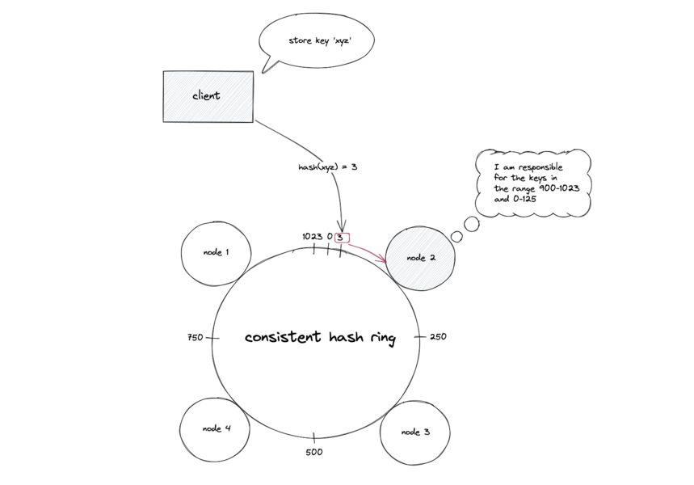

+++
date = '2016-12-07T00:00:00-08:00'
title = '存储的发展'
tags = ["存储"]
+++
## 文件系统
### Professor Eggert's Dumb File System (~1974)
Dr.Eggert在本科期间为了“改进UNIX”，创建了他的第一个文件系统。

- 每个扇区占用512字节
- 第一个扇区分成16份，用于存放文件目录
- 每个目录条目包含文件名、起始位置、文件大小

实际上确实有几种文件系统是参照这种方案实现的，比如[RT-11](https://en.wikipedia.org/wiki/RT-11)，广泛用于实时操作系统。

### FAT - File Allocation Table (~1977)
为了减少碎片化问题，引入了FAT文件分配表

- 保留地址0块，用于引导扇区
- 保留地址1块，用于超级块，包含文件系统信息、版本号、根目录位置等
- 每个目录条目包含文件名、扩展名、第一个块地址、文件大小、标志位等信息，目录也是文件
- 链表结构，顺序访问慢（可通过碎片整理优化）

### Unix File System (~1973)

- 引入inode管理文件索引(index node)
- 树形结构

### Berkeley Fast File System (~1980 4.1b)

- 增加一个块位图，标记数据块是否空闲

## Network File System
网络文件系统, 一种使用于分散式文件系统的协定，由Sun公司开发，于1984年向外公布。允许远程主机通过网络挂载文件系统，并像它们是本地挂载的文件系统一样与它们进行交互。


### MooseFS
具有容错性的网络分布式文件系统。它把数据分散存放在多个物理服务器上，而呈现给用户的则是一个统一的资源。
- Master server - a single machine managing the whole filesystem, storing metadata for every file.
- Chunk servers -  any number of commodity servers storing files data and synchronizing it among themselves.
- Client -  any number of machines using `mfsmount` process to communicate with the managing server and with chunkservers.


## 分布式系统
### CAP
- Consistence 一致性, 所有节点在同一时刻数据相同
- Availability 可用性, 读写总是成功
- Partition Tolerance 分区容错性, 部分节点丢失或无效时，系统仍然可用
  
### NWR
- `W > N / 2` and `W + R > N`
- N 副本数
- W 一次成功的写操作必须完成的写副本数
- R 一次成功的读操作需要读的副本数

### 一致性哈希


- [深入云存储系统Swift核心组件：Ring实现原理剖析](http://www.cnblogs.com/yuxc/archive/2012/06/22/2558312.html)
- [一致性哈希算法的理解与实践](http://yikun.github.io/2016/06/09/一致性哈希算法的理解与实践)

## 对象存储
### LSM-Tree
最初源于BigTable论文，可参考开源LevelDB引擎

- Memtable 内存表，有序，可采用红黑树、跳表，写满时冻结
- SSTable 有序字符串表，采用键值对结构，不可变
- Compaction 当SSTable写满时，合并压缩，同时删除旧数据
- WAL 确保数据安全可靠
- 磁盘顺序写，性能极好，适用于数据有明显冷热区分的日志场景
- 查询扩散，可通过BloomFilter过滤优化

### Bitcask
源自Riak, 一个使用Erlang实现的KV存储引擎
- LSM简化版，仅追加写，无压缩合并
- 更新时，通过对比时间戳，更新key索引指向新记录


### Merkle Tree
多叉树，父节点的Hash值由子节点计算生成，可快速发现集群中的故障节点。

也用于比特币计算


### BeansDB (2009)
豆瓣开源的的分布式存储系统，基于Amazon Dynamo的简化实现。
- 索引采用Merkle Tree
- 底层使用Bitcask存储数据
- Key通过Fnv1a计算定位，根据前缀定位目标Bucket，数据写入，向上更新索引树

```sh
$ telnet 127.0.0.1 7900
get @
VALUE @ 0 170
0/ 43141 9514
1/ 0 0
2/ 42462 2
3/ 39177 2
4/ 37044 1
5/ 44330 3
6/ 45589 3
7/ 28358 3
8/ 17224 3
9/ 5155 3
a/ 53006 1
b/ 27133 4
c/ 26906 3
d/ 0 0
e/ 29129 4
f/ 56710 2

get @42
VALUE @42 0 50
/pay/ucardlogo/1509/2a/1b1fdecfdb5d31.jpg 12806 1

get ?/pay/ucardlogo/1509/2a/1b1fdecfdb5d31.jpg
VALUE ?/pay/ucardlogo/1509/2a/1b1fdecfdb5d31.jpg 0 25
1 12806 1 2853 1442285794
```

- 面向10M以内文件, 如图片, 音频 (默认最高50M,可以改代码)
- RAID10 数据存3份
- 使用ngx_memc
- rsync同步大文件, sync.py同步小对象
- 适用于数百T数据, 数十亿文件

### Swift
OpenStack Object Storage（Swift）前身是 Rackspace Cloud Files 项目，于 2010 年贡献给 OpenStack 社区，是 OpenStack 最早的两个项目之一。Swift 可在比较便宜的通用硬件上构筑具有极强可扩展性和数据持久性的存储系统，支持多租户，通过 RESTful API 提供对容器（Container）和对象的 CRUD 操作。


- Proxy Server 对外提供对象服务API, 查找服务地址并转发用户请求
- Account Server 提供账户元数据和统计信息，并维护所含容器列表的服务
- Container Server 提供容器元数据和统计信息，并维护所含对象列表的服务
- Object Server 提供对象元数据和内容服务，对象以文件的形式存储在文件系统
- Replicator 可选 检测本地分区副本和远程副本是否一致, Push更新副本，删除文件
- Updater 可选 高负载时，将更新请求插入队列，之后进行异步更新
- Auditor 可选 检查对象，容器和账户的完整性，发现比特级进行隔离, 并同步副本
- Account Reaper 可选 账户清理服务，删除容器和对象数据
- Authentication Server 验证用户身份
- Cache Server 可选 缓存认证Token, 账户容器的存在信息, 采用Memcached.

### 映射关系

- 有Account、Container、Object三层服务组成
- 通过MD5计算，根据前缀定位到物理节点
- 物理节点通过后缀划分目录存放数据
```sh
$ tree /srv/node/sdb -L 5
├── accounts
│   ├── 4422
│   │   └── d84
│   │       └── 8a32648058cf2185fab166279963fd84
│   │           ├── 8a32648058cf2185fab166279963fd84.db
│   │           └── 8a32648058cf2185fab166279963fd84.db.pending
│   └── 632
│       └── 84a
│           └── 13c312c524cb52e59041e34e9c4f384a
├── containers (同上)
├── objects
│  ├── 1000
│  │   ├── 6a5
│  │   │   └── 1f462ba176864aa5f5c35e28b533b6a5
│  │   │       └── 1473149348.59743.data
│  │   ├── aba
│  │   │   └── 1f42bcc1bcf1ec440d5d5aec24ddaaba
│  │   │       └── 1464159081.76922.ts
└── tmp
```
索引结构

```sh
$ swift-ring-builder object.builder
object.builder, build version 6
8192 partitions, 2.000000 replicas, 1 regions, 3 zones, 6 devices, 0.02 balance, 0.00 dispersion
The minimum number of hours before a partition can be reassigned is 1
The overload factor is 0.00% (0.000000)
Devices:    id  region  zone      ip address  port  replication ip  replication port      name weight partitions balance meta
             0       1     1     10.86.41.96  6000     10.86.41.96              6000        d1   1.00       2731    0.01 
             1       1     1     10.86.41.96  6000     10.86.41.96              6000        d2   1.00       2731    0.01 
             2       1     2    10.86.35.155  6000    10.86.35.155              6000        d1   1.00       2730   -0.02 
             3       1     2    10.86.35.155  6000    10.86.35.155              6000        d2   1.00       2730   -0.02 
             4       1     3    10.86.35.169  6000    10.86.35.169              6000        d1   1.00       2731    0.01 
             5       1     3    10.86.35.169  6000    10.86.35.169              6000        d2   1.00       2731    0.01 
```

### 
```sh
$ swift-get-nodes /etc/swift/object.ring.gz AUTH_test testdt /no/joss-logo.png
Account  AUTH_test
Containertestdt
Object   /no/joss-logo.png

Partition1778
Hash     3793f1105a148c4a1f180a83a7289f67

Server:Port Device10.86.35.155:6000 d1
Server:Port Device10.86.41.96:6000 d2
Server:Port Device10.86.35.169:6000 d1 [Handoff]
Server:Port Device10.86.41.96:6000 d1 [Handoff]


curl -I -XHEAD "http://10.86.35.155:6000/d1/1778/AUTH_test/testdt//no/joss-logo.png"
curl -I -XHEAD "http://10.86.41.96:6000/d2/1778/AUTH_test/testdt//no/joss-logo.png"
curl -I -XHEAD "http://10.86.35.169:6000/d1/1778/AUTH_test/testdt//no/joss-logo.png" # [Handoff]
curl -I -XHEAD "http://10.86.41.96:6000/d1/1778/AUTH_test/testdt//no/joss-logo.png" # [Handoff]


Use your own device location of servers:
such as "export DEVICE=/srv/node"
ssh 10.86.35.155 "ls -lah ${DEVICE:-/srv/node*}/d1/objects/1778/f67/3793f1105a148c4a1f180a83a7289f67"
ssh 10.86.41.96 "ls -lah ${DEVICE:-/srv/node*}/d2/objects/1778/f67/3793f1105a148c4a1f180a83a7289f67"
ssh 10.86.35.169 "ls -lah ${DEVICE:-/srv/node*}/d1/objects/1778/f67/3793f1105a148c4a1f180a83a7289f67" # [Handoff]
ssh 10.86.41.96 "ls -lah ${DEVICE:-/srv/node*}/d1/objects/1778/f67/3793f1105a148c4a1f180a83a7289f67" # [Handoff]

$ ls /srv/node/d2/objects/1778/f67/3793f1105a148c4a1f180a83a7289f67/
1470970382.20003.data
```
### 
```sh

$ swift-recon object -d  -l -r
===============================================================================
--> Starting reconnaissance on 3 hosts
===============================================================================
[2016-10-19 15:54:25] Checking on replication
[replication_failure] low: 0, high: 0, avg: 0.0, total: 0, Failed: 0.0%, no_result: 0, reported: 1
[replication_success] low: 5408, high: 5408, avg: 5408.0, total: 5408, Failed: 0.0%, no_result: 0, reported: 1
[replication_time] low: 0, high: 0, avg: 0.3, total: 0, Failed: 66.7%, no_result: 2, reported: 1
[replication_attempted] low: 5408, high: 5408, avg: 5408.0, total: 5408, Failed: 0.0%, no_result: 0, reported: 1
Oldest completion was NEVER by 10.86.35.169:6000.
Most recent completion was 2016-10-19 07:43:02 (11 minutes ago) by 10.86.41.96:6000.
===============================================================================
[2016-10-19 15:51:09] Checking load averages
[5m_load_avg] low: 0, high: 0, avg: 0.0, total: 0, Failed: 0.0%, no_result: 0, reported: 3
[15m_load_avg] low: 0, high: 0, avg: 0.0, total: 0, Failed: 0.0%, no_result: 0, reported: 3
[1m_load_avg] low: 0, high: 0, avg: 0.0, total: 0, Failed: 0.0%, no_result: 0, reported: 3
===============================================================================
[2016-10-19 15:51:09] Checking disk usage now
Distribution Graph:
 15%    1 **********************************
 17%    1 **********************************
 18%    1 **********************************
 19%    2 *********************************************************************
 20%    1 **********************************
Disk usage: space used: 22106923008 of 119937073152
Disk usage: space free: 97830150144 of 119937073152
Disk usage: lowest: 15.46%, highest: 20.05%, avg: 18.4321014571%
===============================================================================
```
- 通用存储方案, No RAID
- 多存储策略
- 大文件切分并发上传
- 对象超时机制
- 单容器200w记录无压力
- rsync带宽限制
- recon/informant监控
- 调整 /etc/rsyslog.d/10-swift.conf

### Haystack
Facebook的海量图片存储系统

- [Finding a needle in Haystack: Facebooks photo storage](https://www.usenix.org/legacy/event/osdi10/tech/full_papers/Beaver.pdf)
- 总量260B, 20P, 增量1M 60T/W, 峰值550K/S
- 每张图4种尺寸, 分别存3份
- 三种服务 Cache, Directory, Store
- 两种元信息, Application 生成URL用 / Filesystem 读取文件用

**演化过程**

- POSIX读文件效率低
- 缓存文件句柄, 修改内核增加open by filehandle方法减少IO
- 社交网络长尾效应
- 冗余元数据(文件权限, 所属用户)浪费空间

**HayStack**


- URL结构 `http://<cdn>/<Cache>/<machine id>/<logical volume, photo>`
- CDN 用 logical volume, photo 查缓存, 命中则返回，否则走Cache机
- Cache  同上, 否则走Store机
- Machine 同上, 否则返回错误

### Store服务

- 挂载物理卷(/hay/haystack/<logical valume id>) 作为存储基本单元, 如: 100个100G的物理卷提供10T存储量,系统级用xfs
- 小文件合并成文件块，通过offset和size 直接定位读取
- 异步追加 元信息 到索引文件，加速启动, 运行时全量加载到内存 (由于是异步操作，可能和数据块不一致，启动时需要做对比

### Directory服务
本质上是一个映射表, 用数据库保存信息，提供一个PHP接口

- 维护逻辑卷到物理卷的映射
- 判断请求转发到Store还是CDN
- 负载均衡
- 维护Store状态, 是否空闲/只读
- 为了便于维护, Store可写与容量有关; 扩容时无需文件迁移

### Cache服务
- 缓存文件, 相当于CDN
- 新上传文件直接缓存, 减少Store读写并发


### Needle结构

- cookie 创建时生成, 后续的访问签名
- key 图片编号
- alternate key 图片规格
- padding 8字节对齐

### Needle索引


两级映射 `needle.key => (needle.alternate key => meta)`

### 开源实现
- SeaweedFS 作者为Facebook员工
- bfs - Bilibili File System

```sh
$ go get github.com/chrislusf/seaweedfs/weed

$ weed -master

$ weed volume -dir="./data1" -mserver="localhost:9333" -port=8080
$ weed volume -dir="./data2" -mserver="localhost:9333" -port=8081

$ curl -X POST http://127.0.0.1:9333/dir/assign
{"fid":"8,01995db7d7","url":"127.0.0.1:8080","publicUrl":"127.0.0.1:8080","count":1}
{"fid":"9,02af1b78ce","url":"127.0.0.1:8080","publicUrl":"127.0.0.1:8080","count":1}
$ curl -X PUT -F file=@v6.pdf http://127.0.0.1:8080/8,01995db7d7
{"name":"v6.pdf","size":189495}

$ curl http://localhost:9333/dir/lookup?volumeId=8
{"volumeId":"8","locations":[{"url":"127.0.0.1:8080","publicUrl":"127.0.0.1:8080"}]}
$ curl -I http://127.0.0.1:8080/8,01995db7d7
HTTP/1.1 200 OK
Accept-Ranges: bytes
Content-Disposition: inline; filename="v6.pdf"
Content-Length: 235616
Content-Type: application/pdf
```

## Nginx Proxy
通过lua路由请求

### 
```sh
$ cat nginx/conf/vhost/vh_beansdb.conf

    upstream beansdb_0_b {
        ...
    }

    location / {
        set $memc_key $uri;
        set_by_lua_file $server 'conf/vhost/vh_beansdb_fnv1a.lua';
        memc_pass $server;
    }

$ cat nginx/conf/vhost/vh_beansdb_fnv1a.lua
require "libhash"

buckets = {
  "beansdb_0_b",  "beansdb_0_b",  "beansdb_0_b",  "beansdb_0_b",
  "beansdb_0_b",  "beansdb_0_b",  "beansdb_0_b",  "beansdb_0_b",
  "beansdb_0_b",  "beansdb_0_b",  "beansdb_0_b",  "beansdb_0_b",
  "beansdb_c_f",  "beansdb_c_f",  "beansdb_c_f",  "beansdb_c_f"
}
local bucket_size = 268435456; -- 1 << 32 / bucket_count;
local hash = libhash.fnv1a(ngx.var.memc_key, string.len(ngx.var.memc_key));
local bucket = math.floor(hash / bucket_size);
return buckets[bucket+1];
```

## 图片处理配置
通过[ngx-gm-filter](https://github.com/firebat/ngx-gm-filter)插件实时处理图片
```sh
server {
    gm_buffer 10M;

    location /gm {
         alias imgs;

         set $resize 400x300>;
         set $rotate 180;

         gm strip;
         gm auto-orient;

         gm resize $resize;
         gm rotate $rotate;
         gm quality 85;

         gm gravity SouthEast;
         gm composite -geometry +10+10 -image '/your/watermark/file' -min-width 100;
    }
}
```

## 总结
- 对症下药
- 工具链很重要
- 抄是一门艺术
- RTFSC

Thank You

