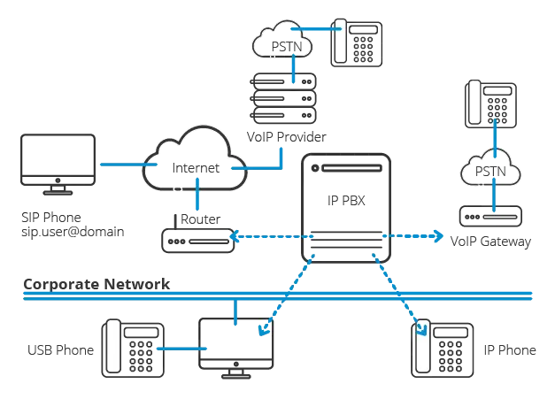

+++
date = '2025-02-28T04:04:38-04:00'
title = '浅析Voip原理'
tags = ["voip"]
+++

P2P技术的发展，产生了各种网络共享下载的应用，如Napster、Gnutella；音视频编码算法的进步、硬件性能的提升以及移动互联网的发展，在我们身边诞生出形形色色的网络应用，如网络电话、网络会议、网络直播等，同时也带来了各种商业上的成功。

- Skype 2003年诞生的一款即时通信应用软件，可通过互联网进行语音和视频通话，2011年微软85亿美元收购。
- FaceTime 2010年苹果公司的一种视频通话应用软件，采用多种开放协议，ACC与H.264的音视频编码。
- WebRTC 2011年Google发起的开源实时通讯解决方案，支持浏览器集成。

作为互联网从业的研发人员，我们有必要了解一下，这一切是怎么发生的，其内部是如何实现的。

# 网络
因为互联网的快速发展，联网设备数量远超设计者的最初设想，整个IPv4的地址范围不够用，因此引入了NAT技术。NAT（Net Address Translate）网络地址转换，简单来说就是在路由层记录私有网络和公有网络的IP映射关系，并进行IP数据包的修改，实现了公网IP复用的技术。


根据路由器对私网IP端口到公网IP端口的映射方式，RFC3489中将NAT分为四种类型

- Full Cone NAT（全锥型），同一内部IP端口发出的请求，被映射到相同的外部IP端口；任何外部主机通过向映射的地址发送报文，实现与内部主机通信。
- Restricted Cone NAT（受限锥型），发出同上；当且仅当内部主机之前向公网主机发送过报文，公网主机才能与其通信。
- Port Restricted Cone NAT（端口受限锥型）发出同上；限制条件包括端口。
- Symmetric NAT（对称型）所有内部IP端口向特定目的IP端口发出的请求，都被映射成同一个IP和端口。只有接收到数据的公网主机才能反向与内部主机通信。

# 类型检测
要检测当前主机所在的NAT类型，需要在云端部署一个服务，包含两个IP和端口

- 客户端向服务器发送请求，服务器将观察到的地址响应给客户端
- 如果响应中的地址与发送地址一致，说明客户端在公网，没有NAT。

- 客户端向服务端第二个IP地址再发送一个请求
- 如果两次响应中的公网地址不一致，说明是对称型

- 客户端向服务器第一个IP地址发送请求，服务端用另一个IP地址返回
- 如果可以收到，说明是全锥型

- 客户端向服务器再发送一个请求，服务器用同一IP的第二个端口响应
- 如果可以收到，说明是受限锥型；否则为端口受限锥型。

# NAT穿透
NAT技术解决了IPv4不够用的问题，同时也导致TCP/IP通信困难，外部主机无法主动与内部主机通信，所有服务不得不采用C/S架构，导致高额的带宽成本。为了节约网络带宽成本，将客户端也作为资源提供方减少对服务的访问，因此产生了P2P技术。即Peer-to-Peer，点对点技术，其中最关键的技术之一，就是NAT设备穿透，俗称打洞。

## 反向链接
通信双方只有一个节点位于NAT中

- A请求B时，可以直接发起
- B请求A时，通过S转发给A一个连接请求，A再发起请求

## 简单场景
双方位于同一个NAT设备之后

- A与B分别与S建立连接，S记录下双方的内网信息，以及自己观察到的公网信息；
- A向S发起连接B的请求；S分别向双方发送对方的公网和内网地址；
- A和B收到信息后，同时向对方发起连接；推荐优先使用内网地址，直接通过交换机通信，速度快。也可以使用公网地址，需要网关支持Hairpin技术。

## 普遍场景
双方位于不同的NAT设备之后

- A与B分别与S建立连接，S记录下双方的内网信息，以及自己观察到的公网信息；
- A向S发起连接B的请求；S分别向双方发送对方的公网和内网地址；
- A和B的同时使用对方的公网地址发送数据包

### 双方为锥型

- A向B发送打洞包建立映射
- B向A发送打洞包建立映射
- 打洞成功

### 对称型和普通锥形（全锥型、受限锥型）

- A使用PA2向B发送打洞包，建立映射
- B使用PB1向PA1发送打洞包，建立映射
- B通过PB1收到A的打洞包，根据对方的NAT类型，后续使用PA2与A连接
- 打洞成功

### 对称型和端口受限型
- 流程同上
- 由于端口受限，B无法在PB1上接收PA2发来的打洞包
- 打洞失败

### 双方都是对称型
- 场景更严格，原理同上，无法打洞

判断网络是否能够打通，有一种简单的计算方法
```
1. Full Cone
2. Restricted Cone
3. Port Restricted Cone
4. Symmetric

若两端的NAT类型序号之和<=6，可以穿透；否则不可穿透。
```
## 典型场景
双方位于多层NAT设备之后，上层设备由网络提供商（ISP）提供，下层是家用路由器。

这里，只有服务器S和NAT C拥有真正的公网地址，而NAT A和B的公网地址实际为ISP设定的“伪公网”地址。由于S无法观察到这些“伪公网”地址，所以A和B无法通过NAT A直接与NAT B连接，即使通过特殊手段可以拿到也不建议使用，因为极易造成地址域重复冲突。A和B只能通过NAT C进行打洞转发。

# STUN服务
RFC3489 - Simple Traversal of UDP Through NAT 或 RFC5389 - Session Traversal Utilities for NAT
上述NAT穿透的S就是STUN服务，它允许客户端发现与公网之间的NAT类型，以及NAT给其分配的公网地址和端口，默认端口为3478。

```
$ stunclient stun1.l.google.com
Binding test: success
Local address: 10.4.39.11:59092
Mapped address: 139.177.225.224:59092
```
# TURN服务
RFC5766  - Traversal Using Relays around NAT：STUN的中继扩展
通过STUN服务，A和B可以发现对方，但因为NAT类型或防火墙的原因不一定能够连接成功，这时就需要引入TURN服务。在云端假设一台中继服务，它负责双方数据的转发。当他们进入到同一个房间之后，TURN就会对房间里的所有人进行转发。

- 反射地址 Server-Reflexive Transport Address，即NAT分配的公网地址
- 中继地址 Relayed Transport Address，即TURN服务为客户端分配的代理地址

## 分配事务
- 客户端向中继服务发送一个Allocate请求，服务器为客户端分配一个公网的中继地址。
- 客户端定时向服务发送Refresh请求，用于保活。
```
  TURN                                 TURN           Peer          Peer
  client                               server          A             B
    |-- Allocate request --------------->|             |             |
    |                                    |             |             |
    |<--------------- Allocate failure --|             |             |
    |                 (401 Unauthorized) |             |             |
    |                                    |             |             |
    |-- Allocate request --------------->|             |             |
    |                                    |             |             |
    |<---------- Allocate success resp --|             |             |
    |            (192.0.2.15:50000)      |             |             |
    //                                   //            //            //
    |                                    |             |             |
    |-- Refresh request ---------------->|             |             |
    |                                    |             |             |
    |<----------- Refresh success resp --|             |             |
    |                                    |             |             |
```
## 发送数据
开启中继地址后，客户端首先完成鉴权，检查是否有发送权限，之后就可以发送数据了。
客户端使用Send信令发送数据到服务端，服务端接收解包后，将内容数据转发给对端。Send数据包包含
- XOR-PEER-ADDRESS 对端地址（对方的公网地址）
- DATA 内容数据
为了避免攻击，使用Send/Data发送数据前需要完成许可验证，否则数据包将被丢弃
```
  TURN                                 TURN           Peer          Peer
  client                               server          A             B
    |                                    |             |             |
    |-- CreatePermission req (Peer A) -->|             |             |
    |<-- CreatePermission success resp --|             |             |
    |                                    |             |             |
    |--- Send ind (Peer A)-------------->|             |             |
    |                                    |=== data ===>|             |
    |                                    |             |             |
    |                                    |<== data ====|             |
    |<-------------- Data ind (Peer A) --|             |             |
    |                                    |             |             |
    |                                    |             |             |
    |--- Send ind (Peer B)-------------->|             |             |
    |                                    | dropped     |             |
    |                                    |             |             |
    |                                    |<== data ==================|
    |                            dropped |             |             |
    |                                    |             |             |
```
当传输数据量非常大时（比如流媒体）每个数据包都包含30多个字节头对带宽影响很大。这是可以通过ChannelBind命令创建一个Channel，之后使用一个仅包含Channel Id的4字节头部。信道号可用范围为0x4000-0x7FFF，一共可以有16838个。
```
  TURN                                 TURN           Peer          Peer
  client                               server          A             B
    |                                    |             |             |
    |-- ChannelBind req ---------------->|             |             |
    | (Peer A to 0x4001)                 |             |             |
    |                                    |             |             |
    |<---------- ChannelBind succ resp --|             |             |
    |                                    |             |             |
    |-- [0x4001] data ------------------>|             |             |
    |                                    |=== data ===>|             |
    |                                    |             |             |
    |                                    |<== data ====|             |
    |<------------------ [0x4001] data --|             |             |
    |                                    |             |             |
    |--- Send ind (Peer A)-------------->|             |             |
    |                                    |=== data ===>|             |
    |                                    |             |             |
    |                                    |<== data ====|             |
    |<------------------ [0x4001] data --|             |             |
    |                                    |             |             |
```
# ICE框架
Interactive Connectivity Establishment 互动式连接建立，它不是一种协议，而是一个框架，整合了STUN和TURN，使各种穿透技术实现统一。通过收集所有通路，将所有的连接可能性都罗列出来，根据优先级算法排序后找到一条最优路径。
- 通过STUN绑定，客户端拿到它的地址信息
- 通过TURN服务Allocate一个中继地址，用于接收数据
- 发起方通过信令主机将自己的媒体、网络等基本信息使用SDP（会话描述协议）发送给被调用方
- 被调用方接收到连接请求后回应一个Answer请求，完成数据交换
- 通过ICE框架，首先尝试P2P连接，一个端口或者某个网卡不通时，选其他的。如果都通，选择性能最好的。
- 如果P2P不通则使用TURN中转，并且支持多节点选择，若上海的节点不通，就用东京的节点。

ICE Candidate定义一个可用地址，包括协议、IP、端口和类型，双方各取一个Candidate形成通路。类型有
- 主机候选者 Host Candidate 本地主机的IP和端口
- 反射候选者 Reflexive Candidate 通过向STUN服务请求NAT映射之后的公网IP地址和端口（非伪公网）
- 中继候选者 Relay Candidate 通过向TURN服务发送Allocate请求，分配的中继IP地址和端口

# SDP描述
Session Description Protocol 会话描述协议，不是传输协议，只是一种格式定义；用于通信双方交换信息，包括会话描述、时间信息、多媒体信息等，如：
```
v=0                                                        // 版本
o=jdoe 2890844526 2890842807 IN IP4 203.0.113.141          // Owner标识
s=                                                         // 会话名
c=IN IP4 192.0.2.3                                         // 连接信息
t=0 0                                                      // 信息信息
a=ice-options:ice2                                         // 附加属性
a=ice-pacing:50
a=ice-pwd:asd88fgpdd777uzjYhagZg
a=ice-ufrag:8hhY
m=audio 45664 RTP/AVP 0                                    // 多媒体信息
b=RS:0                                                     // 带宽信息
b=RR:0
a=rtpmap:0 PCMU/8000                                       // 编码方式
a=candidate:1 1 UDP 2130706431 203.0.113.141 8998 typ host
a=candidate:2 1 UDP 1694498815 192.0.2.3 45664 typ srflx raddr
203.0.113.141 rport 8998
```
其中最后两条提供了Candidate的候选通路
- 第一个是UDP类型，类型是host
- 第二个是UDP类型，类型是穿越NAT的映射地址
这里面没有relay类型的地址，说明不需要中继传输。可能在同一个局域网中，或者穿越NAT使用P2P连通。

# SIP信令
RFC2543 Session Initiation Protocol 会话初始协议，是一个应用层协议，用于建立、更改和终止多媒体会话，是通信的基础。
- 用户代理 UA, User Agent 即SIP终端，包含客户端（UAC，User Agent Client）和服务端（UAS，User Agent Server）两种类型。
- 注册服务器（Registrar Server）接收用户注册，注册内容存放在位置服务器，供后续查询。
- 位置服务器（Location Server）为代理服务器和重定向服务器提供UA信息。
- 代理服务器 Proxy Server 用于传递主角方（Caller）发送的会话请求到被叫方（Callee）
- 重定向服务器 Redirect Server 用于指示客户端连接新的地址，新地址可能是被叫方的UA地址，也可以是另一个代理服务地址。

## 注册
```
    Bob                        SIP Server
     |                               |
     |          REGISTER F1          |
     |------------------------------>|
     |      401 Unauthorized F2      |
     |<------------------------------|
     |          REGISTER F3          |
     |------------------------------>|
     |            200 OK F4          |
     |<------------------------------|
```
```
REGISTER sips:ss2.biloxi.example.com SIP/2.0
Via: SIP/2.0/TLS client.biloxi.example.com:5061;branch=z9hG4bKnashds7
Max-Forwards: 70
From: Bob <sips:bob@biloxi.example.com>;tag=a73kszlfl
To: Bob <sips:bob@biloxi.example.com>
Call-ID: 1j9FpLxk3uxtm8tn@biloxi.example.com
CSeq: 1 REGISTER
Contact: <sips:bob@client.biloxi.example.com>
Content-Length: 0
```
- Via 由服务器生成，用于记录请求路径，可以使响应找到回路
- Max-Forwards 消息最大转发次数，每转发一次减1，为0时响应483（Too Many Hops response）
- From 请求发送方标识
- To 请求接收方标识，因为这里是注册请求，所以与From一致
- Call-ID 标识一个特定的会话或注册消息，随机生成，全球唯一
- Cseq 请求序列号，区分同一会话中的不同请求
- Contact 用户代理UA的通信地址

## 呼叫
以最基本的会话流程为例
```
 Alice                 Proxy                 Bob
    |   F1 INVITE        |                    |    // Alice向代理发起会话请求
    |------------------->|      F2 INVITE     |    // Proxy查找到Bob的地址并转发呼叫
    |   F3 100 Trying    |------------------->|    // Proxy向Alice响应，避免重复呼叫
    |<-------------------|   F4 180 Ringing   |    // Bob响铃响应
    |   F5 180 Ringing   |<-------------------|
    |<-------------------|                    |
    |                    |    F6 200 OK       |    // Bob接起电话
    |    F7 200 OK       |<-------------------|
    |<-------------------|                    |
    |                 F8  ACK                 |    // Alice回应OK，会话建立
    |---------------------------------------->|
    |      Both Way RTP Media Established     |    // 双方开始数据传输
    |<=======================================>|
    |                 F9  BYE                 |    // Alice方挂断会话
    |---------------------------------------->|
    |               F10 200 OK                |    // Bob收到并响应，会话结束
    |<----------------------------------------|
```
```
F1 INVITE Alice -> Proxy

INVITE sip:bob@biloxi.example.com SIP/2.0
Via: SIP/2.0/UDP client.atlanta.example.com:5060;branch=z9hG4bK74bf9
Max-Forwards: 70
From: Alice <sip:alice@atlanta.example.com>;tag=9fxced76sl
To: Bob <sip:bob@biloxi.example.com>
Call-ID: 2xTb9vxSit55XU7p8@atlanta.example.com
CSeq: 1 INVITE
Contact: <sip:alice@client.atlanta.example.com>
Content-Type: application/sdp
Content-Length: 151

v=0
o=alice 2890844526 2890844526 IN IP4 client.atlanta.example.com
s=-
c=IN IP4 192.0.2.101
t=0 0
m=audio 49172 RTP/AVP 0
a=rtpmap:0 PCMU/8000
```
```
F4 180 Ringing Bob -> Proxy

SIP/2.0 180 Ringing
Via: SIP/2.0/UDP ss2.biloxi.example.com:5060;branch=z9hG4bK2d4790.1;received=192.0.2.222
Via: SIP/2.0/UDP client.atlanta.example.com:5060;branch=z9hG4bK74bf9;received=192.0.2.101
From: Alice <sip:alice@atlanta.example.com>;tag=9fxced76sl
To: Bob <sip:bob@biloxi.example.com>;tag=314159
Call-ID: 2xTb9vxSit55XU7p8@atlanta.example.com
CSeq: 1 INVITE
Contact: <sip:bob@client.biloxi.example.com>
Content-Length: 0
```
信令通过两个Via找到回路
```
F6 200 OK Bob -> Proxy

SIP/2.0 200 OK
Via: SIP/2.0/UDP ss2.biloxi.example.com:5060;branch=z9hG4bK2d4790.1;received=192.0.2.222
Via: SIP/2.0/UDP client.atlanta.example.com:5060;branch=z9hG4bK74bf9;received=192.0.2.101
From: Alice <sip:alice@atlanta.example.com>;tag=9fxced76sl
To: Bob <sip:bob@biloxi.example.com>;tag=314159
Call-ID: 2xTb9vxSit55XU7p8@atlanta.example.com
CSeq: 1 INVITE
Contact: <sip:bob@client.biloxi.example.com>
Content-Type: application/sdp
Content-Length: 147

v=0
o=bob 2890844527 2890844527 IN IP4 client.biloxi.example.com
s=-
c=IN IP4 192.0.2.201
t=0 0
m=audio 3456 RTP/AVP 0
a=rtpmap:0 PCMU/8000
```
同一个Call-ID会话中的第二个请求，序号CSeq增加
```
F9 BYE Alice -> Bob

BYE sip:bob@client.chicago.example.com SIP/2.0
Via: SIP/2.0/UDP client.atlanta.example.com:5060;branch=z9hG4bK74bo4
Max-Forwards: 70
From: Alice <sip:alice@atlanta.example.com>;tag=9fxced76sl
To: Bob <sip:bob@biloxi.example.com>;tag=314159
Call-ID: 2xTb9vxSit55XU7p8@atlanta.example.com
CSeq: 2 BYE
Content-Length: 0
```
# PBX
通过上述的P2P打洞技术，实现了客户端之间的数据包传输；通过SIP指令和SDP，实现了会话的管理。实际场景中，将这些技术统一构建为IP PBX服务（Private Branch Exchange）即网络电话交换机。IP PBX不仅可以通过网络连接企业内部电话，还可以通过PSTN（Public Switched Telephone Network）公共交换电话网连接传统电话。

[FreeSwitch](https://freeswitch.org.cn/) 是一个开源、免费、跨平台、支持多协议的电话软交换平台，最初由Asterisk项目的的开发者Anthony Minessal创建。
- 采用模块化设计，允许用户根据需要，定制化解决方案
- 支持灵活的脚本定制，如Lua、Javascript、Python，方便与各种系统集成
- 支持多种协议，可以与各种开源的PBX系统集成，如sipXecs、Call Weaver、Asterisk等
使其成为构建语音、视频和消息应用的理想选择，广泛应用于电话系统、呼叫中心、会议系统等。由于采用高性能的C语言开发，许多ISP和运营商把它作为关键软交换设备处理成千万上万路的并发通话，广泛应用于金融、电力、石油、煤炭等领域的呼叫中心、企业通信以及应急指挥调度平台等。在移动互联、物联网、大数据、云计算盛行的时代，许多创业者也把它用于通信领域的云平台。

# 参考
- [Peer-to-Peer Communication Across Network Address Translators](https://pdos.csail.mit.edu/papers/p2pnat.pdf)
- https://datatracker.ietf.org/doc/html/rfc2543 SIP: Session Initiation Protocol 
- https://datatracker.ietf.org/doc/html/rfc3261 SIP: Session Initiation Protocol 
- https://datatracker.ietf.org/doc/html/rfc3489 STUN - Simple Traversal of UDP 
- https://datatracker.ietf.org/doc/html/rfc3665 SIP Basic Call Flow Examples 
- https://datatracker.ietf.org/doc/html/rfc5766 Traversal Using Relays around NAT (TURN) 
- https://datatracker.ietf.org/doc/html/rfc5780 NAT Behavior Discovery Using STUN
- https://datatracker.ietf.org/doc/html/rfc5389 Session Traversal Utilities for NAT (STUN)
- https://datatracker.ietf.org/doc/html/rfc8445 Interactive Connectivity Establishment (ICE)
- https://datatracker.ietf.org/doc/html/rfc8489 Session Traversal Utilities for NAT (STUN)
- https://www.gnu.org/software/bayonne/ GNU telephony server
- https://www.gnu.org/software/sipwitch/ GNU VoIP server
- https://github.com/yatevoip/yate Yate - Yet Another Telephony Engine